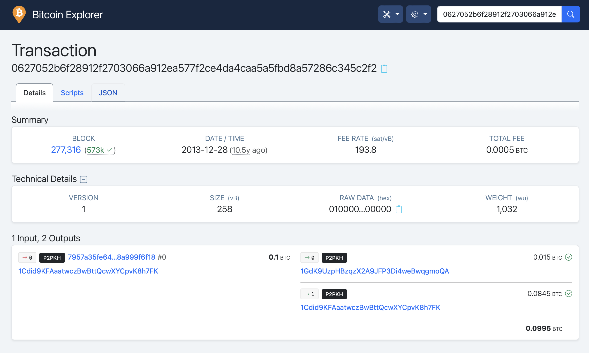

# Mastering Bitcoin (Antonopoulos Book): My Notes

These a re my notes of the book **"Mastering Bitcoin", by A. Antonopoulos (O'Reilly)**.

I have extended the content of the book with my own tests, e.g., using a toy node.

Mikel Sagardia, 2020.  
No guarantees.

## Chapter 1: Introduction

The book has its own repository:

[Mastering Bitcoin Book GitHub Repository](https://github.com/bitcoinbook/bitcoinbook)

I have used some of the media and material in that repository in my notes/summary.

### Setup a Node

To test many things explained in the book it is helpful to have a node up and running. To see how to set up a node, check the co-located guide [`../bitcoin_practical/Bitcoing_Practical_Guide.md`](../bitcoin_practical/Bitcoing_Practical_Guide.md). Example nodes easy to setup using a Raspberry Pi:

- [MyNode](https://mynodebtc.github.io)
- [Umbrel](https://umbrel.com)

## Chapter 2: How Bitcoin Works

### Basics

Bitcoin system consists of:

- Wallets containing keys that can sign transactions.
- Transactions that are propagated across the network, peer-to-peer, without central "authority".
- Miners who produce (through competition) the consensus blockchain; every 10 minutes approximately miners compete for solidifying a block of transactions. The difficulty of the mining activity needs to be adjusted so that the 10 minute block time is maintained constant regardless of the number of miners in the system.

Bitcoin is not only a digital currency, it's also a network that solves the trust problem without centralized agents that provide it.

Some other properties of Bitcoin:

- There will be 21 million coins.
- Every block, bitcoin is created and delivered to the miner who won the mining race.
- Every 4 years the block subsidy is halved: that's known as the halving.
- The last coin will be mined around 2140.
- Bitcoin is not anonymous: once an identity is attached to an address, all associated transactions are easy to identify and track.
- There are different types of wallets: Desktop, Mobile, Web, Hardware (cold), Paper (cold), etc.
- There are several types of nodes:
  - Full node: it has an updated, life copy of the blockchain.
  - Lightweight node: Simple-Payment-Verification (SVP) node, which contains part of the blockchain and connects to full nodes to have access to all transactions.
  - Miner node: a node with mining capabilities, often part of a pool.

### Bitcoin Explorers

Example: [Blockchain Explorer](https://www.blockchain.com).

:warning: **IMPORTANT NOTE: Whenever you use an online service, your IP is logged with the info you check! Use the explorer from your node!**

Usage with the transaction `0627052b6f28912f2703066a912ea577f2ce4da4caa5a5fbd8a57286c345c2f2` made by Andreas Antonopoulos:

- `https://www.blockchain.com/btc/tx/<tx-id>`
- `https://www.blockchain.com/btc/tx/0627052b6f28912f2703066a912ea577f2ce4da4caa5a5fbd8a57286c345c2f2`

Better use a **local bitcoin explorer** for our transactions, e.g., the one from MyNode:



If we have access to a bitcoin node (e.g., with [MyNode](https://mynodebtc.github.io)), we can check the transaction info as follows:

```bash
# Log in via SSH; we might need to use the local IP
ssh admin@mynode.local


```

### Transactions

Transactions consist of inputs and outputs:

- Inputs = Outputs + Fees
- Inputs: Debits
- Outputs: Credits (receiver, new address)
- Bitcoin addresses transfer value (inputs) to new Bitcoin addresses (outputs).
- A small fee is taken from the inputs, which goes to the node that writes the transaction into the blockchain; so the miner earns the block subsidy and the fees.
- Several inputs and outputs (& addresses) can appear in a transaction.
- Spending = Signing a transaction that transfers value to a new address.
- Inputs contain proof of ownership, independently verifiable.

#### Transaction Chains

- The input values in a transaction know the transaction they come from
- Previous outputs are divided into:
  - Spent: Fractions that are used as inputs for successive transactions
  - Unspent: Fractions that are not used (by now) = UTXO
- Wallet keys basically unlock the transaction outputs of previous transactions

#### Making Change

- When value is transferred from an address (input) to another (output)
- If the coins in the input address don't match the transferred value + fees, change is generated and returned to the input wallet, but maybe to a new address
  - That's the change address

#### Common Transaction Forms

1. **Simple Payment**
   - Input 0: From Alice, signed by Alice
   - Output 0: To Bob
   - Output 1: To Alice: Change

2. **Aggregated Inputs**
   - Inputs 0 - N: From Alice, signed by Alice
   - Output 0: To Bob

3. **Distributed Outputs**
   - Input 0: From Alice, signed by Alice
   - Outputs 0 - N: To several wallets/addresses

Great! Let's continue with the next sections:

### Constructing a Transaction

A wallet needs:
1. Destination (public) address
2. Amount

To construct the transaction, which can even happen offline!

A wallet connected to a full node knows about all the unspent coins/output; therefore, they can quickly verify any incoming transaction!

Outputs are created like scripts:
- Anyone who can provide proof/signature of having the destination wallet receives the coins

The peer-to-peer Bitcoin network propagates the transactions:
- Any node that receives and confirms a transaction immediately forwards it to the nodes connected to it

**COMMON MISCONCEPTION:** That transactions must be confirmed waiting 10 minutes for a new block or 60 minutes (6 blocks)
- Confirmations ensure that the transaction has been accepted by the whole network
- But, if A pays to B in front of him/her and B receives the transaction notification, there's no need to wait
- Confirmations are rather for the rest of the network or maybe for huge values

### Bitcoin Mining

- Transactions are propagated through the network and aggregated into blocks, which are included in the blockchain = this is through mining

- There is a pool of unverified transactions where all new transactions land
  - Transactions are prioritized, among others, according to the fees paid by the senders
  - Each mining node creates a block to be added by stacking:
    1. Next prioritized transactions
    2. A reward transaction for itself: aggregated fees for prioritized transactions + new Bitcoin issued
    3. A fingerprint of the previous block
  - And then start guessing a puzzle which is:
    - Very difficult to guess
    - But very easy to verify
    - So, like a sudoku, it's asymmetrically hard to solve/verify

So:
- Every 10 minutes, all nodes start competing
- Only the node which first guesses the game writes the block and receives the reward
- When a node makes the guess, it notifies its peers, and they verify it and start competing for the next block

The game/value to be guessed is called Proof-of-Work (PoW):
- The header of the block + random number are hashed to obtain a pattern
- The random number is the sought value!

The difficulty of the game is adjusted depending on the nodes in the network so that the value can be guessed every 10 minutes (= a block created every 10 minutes)

**Nowadays:**
- ASICs are used: Hardware in which mining algorithms are printed
- Miners join in mining pools: many miners who share rewards

**Terms:**
- **Block Height:** Number of blocks since genesis block until block with observed transaction
- **Block Depth:** Number of blocks from observed block until very last added

**Some Insights:**
- As blocks pile on each other, they become exponentially harder to falsify/reverse -> more trusted
  - By convention, a block with 6+ confirmations is irrevocable because it would require much energy to invalidate and recalculate the 6 blocks
- Blocks can be written into the blockchain if Proof-of-Work is shown
- Writing a block means getting the reward
- Therefore, we do not need a central authority: distributed nodes compete and respect the easy-to-verify rules

### Spending the Transaction

**Key Ideas:**
- Each Bitcoin client can verify a transaction as valid
- Full nodes can track the source of funds until the moment in which they were generated
- SPV nodes (Simplified Payment Verification, or lightweight) can confirm that the transaction is in the blockchain and has several blocks mined after it

## Chapter 3: Bitcoin Core: The Reference Implementation

**Bitcoin Core: Repository**
- [Bitcoin Core GitHub Repository](https://github.com/bitcoin/bitcoin)
- MIT license
- Originally published by Satoshi Nakamoto, now handled by many other developers
- Original Bitcoin Core implementation has:
  - Wallet - but better use another one, more secure
  - Transaction & block validation engine
  - Full network node

**Bitcoin Core Compilation**
- Compilation done step by step - I've done that already
- After compilation, we get two main executables:
  - `/usr/local/bin/bitcoind`: The node running all the time
  - `/usr/local/bin/bitcoin-cli`: The client to connect to the node

**Configuration**
- Set the configuration file `~.bitcoin/bitcoin.conf`
  - Choose strong password for RPC
  - `bitcoind --help` displays all possible config parameters, like:
    - `datadir`: Where the blockchain data will go
    - `prune`: Delete old blocks
    - `txindex`: Maintain index of transactions (set it to 1 if we want to check any transaction)
    - `maxconnections`
    - ...

**Starting Bitcoin Node**
- `bitcoind -daemon`
- Usually, it's set to the start-up files/script

**Getting Info from the Node**
- `bitcoin-cli [command]`

**Bitcoin Core Application Programming Interface: bitcoin-cli**
- `bitcoin-cli` is a JSON-RPC interface
  - RPC = Remote Procedure Call
  - It means: `bitcoin-cli` is the client which requests the server `bitcoind` (the node) for info, which is delivered as JSON strings

**bitcoin-cli Commands**
- `bitcoin-cli help [command]`
  - Example: `bitcoin-cli help getblockhash`
- `bitcoin-cli getinfo`: Status of our node
- `bitcoin-cli getrawtransaction <tx id>`: Hexadecimal code of transaction is returned; we need to decode it
- `bitcoin-cli decoderawtransaction <tx hexadecimal>`: JSON string of transaction is returned; we see the values and the addresses in it
- `bitcoin-cli getblockhash 1000`: Hash of block with index 1000, we need to decode it; the index or id is called the height
- `bitcoin-cli getblock <block hash>`: JSON string of block returned; here, we can see all the transactions of the block and follow the transactions

**RPC Interface**
- We can access the node via HTTPS protocol
  - For instance using curl or any other tool
  - There is an example in the book for that
  - Another option is to use libraries that do that

**Libraries**
- Many libraries, e.g., for Python: `python-bitcoinlib`
  - [python-bitcoinlib GitHub Repository](https://github.com/petertodd/python-bitcoinlib)

**Three Examples Shown**
1. Get number of blocks so far
2. Get outputs of a transaction
3. Get all the outputs of all transactions in a block

## Chapter 4: Keys, Addresses

**Bitcoin Communication & Data Are Not Encrypted**
- We have three main elements:
  1. **Digital or Private Keys**
     - Not stored on the network, but in wallets
     - Used to create identity signatures: we can spend satoshis linked to an address if we show the signature of the private key
     - Used to create public keys
     - They can be generated and managed without access to the blockchain!
     - So, used to spend funds, it's like the PIN
  2. **Public Keys**
     - Created from the private key: easy to create and verify, but impossible to get original private key
     - Used to receive funds
  3. **Addresses**
     - Hashed public keys
     - Usually, the elements used to send/receive
     - Behind an address we can have a wallet or a script

**Public Key Cryptography** (Not in the Book)
- [Public Key Cryptography Explanation](https://www.youtube.com/watch?v=AQDCe585Lnc&vl=en)

**Two Main Types of Encryptions:**
1. **Symmetric**
   - Create a key/password used to encrypt content
   - Same key used to decrypt content
   - Issue: sharing the key can be unfeasible or dangerous
2. **Asymmetric**
   - Create a key pair: private and public key
     - Private key is kept private, never shared
     - Public key is shared with all peers
   - If a peer wants to send content, they encrypt it with the public key
   - Receiver decrypts it with the linked private key

**Notes on Asymmetric Encryption:**
- Key private-public key pair is linked, but:
  - Derive public key from the private one
  - Cannot obtain the private key from the public
- Private key decrypts content encrypted only by its linked public key

**Applications Using Asymmetric Encryption:**
1. **HTTPS (SSL)**
   - Web owner pays an authority to keep a private key of the website
   - When visiting the web, the browser gets the public key of the web and the address of the authority
   - The web provides a message from the authority encrypted with the public key
   - Authority decrypts the message; if correct, the web's identity is verified
2. **Bitcoin**
   - Verify ownership of funds by decrypting a message encrypted with the address/public key
3. **SSH**
   - Similar to HTTPS to verify identities
4. **PGP or GPG**
   - Pretty Good Privacy: asymmetric encryption for emails/messages
   - Install on Thunderbird or use GPG Keychain application
   - Alternatively, use command line tool to do everything manually
     - [GPG Command Line Guide](https://blog.ghostinthemachines.com/2015/03/01/how-to-use-gpg-command-line/)
     - Install with:
       - `brew install gnupg`
       - `sudo apt-get install gnupg`
       - `gpg --gen-key`
       - ...

**Private & Public Keys:**
- Private key (k) -> (elliptic curve multiplication) -> Public key (K) -> (hashing) -> Bitcoin Address (A)
  - Can only go one way, not back

**Main Idea:**
- Spend signature can be generated only with the private key but can be verified by the public key available to anyone
- Private key is a random number of 256 bits: 2^(256)
  - Usually encoded in:
    - Hexadecimal: base 16 = base 4 bits = 2^4
    - Base58: base 64 - 6 characters difficult to distinguish

**How to Obtain:**
- `bitcoin-cli getnewaddress`: Private key is generated and address returned
  - `<address>`
- `bitcoin-cli dumpprivkey <address>`: If we input our generated address, wallet is opened and its private key is returned
  - Note: cannot obtain the private key of an arbitrary address, but open the wallet and return the private key

**Public Keys Created by Elliptic Curve Multiplication:**
- Elliptic curve multiplication is irreversible
- Elliptic curve: y^2 = x^3 + 7 discretized
  - Symmetric on x
  - Coordinates (x, y) each a possible private key of all 2^256
  - Addition of points P1 & P2 of the curve:
    - Draw a line between P1 & P2 and where it intersects, we have P3'
    - Reflect its y value, we have P3
  - Multiplication is defined as a sum:
    - k * P = P + P + P + ..., k times
    - Adding a point P to itself is basically throwing the tangent line and reflecting the intersection point
  - Public key (K) created by elliptic curve multiplication:
    - K = G * k
      - K: Public key
      - G: Generator point, same and known to everyone
      - k: Private key

**Bitcoin Addresses:**
- Bitcoin address can be:
  - Owner of a private key
  - Payment script
- Address created by double-hashing the public key with SHA256 and RIPEMD160:
  - A = RIPEMD160(SHA256(K))

**Encoding:**
- Base58: Base64 - 6 symbols difficult to distinguish = 0-9, a-z, A-Z - (0, O, l, I)
- Base58Check: Base58 with additional checksum at the end; prefix to denote it's a Base58Check address
  - Prefix 1: Bitcoin address
  - Prefix 3: Payment address

**Key Formats:**

1. **Private Key Formats:**
   - Raw: 32 bytes
   - Hex: 64 hexadecimal digits
   - WIF = Wallet Import Format = Base58Check: prefix 5
   - WIF-compressed = Prefix K or L, suffix 0x01 (this hexadecimal suffix is converted to Base58Check)
     - Note: WIF-compressed are not really compressed, it means they should be used to derive compressed public keys

2. **Public Key Formats:**
   - Public keys can be compressed/uncompressed
   - Recall a public key is a point (x,y) in the elliptic curve
     - Since the elliptic curve is symmetric in x, we just need x and the sign of y!

   - **Uncompressed Public Key Format:**
     - 04 x y
     - 04: Prefix
     - x: 256-bit x coordinate of the point on the elliptic

 curve
     - y: 256-bit y coordinate

   - **Compressed Public Key Format:**
     - 02 x (y positive)
     - 03 x (y negative)

   - **Notes:**
     - If we hash a compressed or uncompressed key, the result is different!
     - However, the private key is the same!
     - To enable compatibility, private keys have a suffix 0x01 when they need to be used to generate compressed public keys
       - That's the WIF-compressed format = Base58Check + suffix 0x01 (hexadecimal)

**Encrypted Private Keys (BIP-38):**
- BIP = Bitcoin Improvement Proposal
- Private keys encrypted with a passphrase (password) - need that password to decrypt them again
- Result is a private key in Base58Check that begins with 6P

**Pay-to-Script Hash (P2SH) and Multisig Addresses:**
- Bitcoin addresses which begin with 3 designate a script as the beneficiary
  - The script specifies the conditions to spend the funds
- Most common implementation: Multisignature address script
  - Script requires M signatures of N>=M to prove ownership and spend funds

**Vanity Addresses:**
- Addresses that contain human-readable parts, e.g., 1Love...
  - Generated by testing random private keys until the desired pattern appears
  - Pattern of 4 symbols can be found in ~1 minute
  - Pattern of 10 requires ~46,000 years

**Paper Wallets:**
- Very good for cold storage
  - IMPORTANT: Can deposit several times, BUT should withdraw only once!
    - Reason: Sometimes change addresses are created
- Sometimes keys are encrypted and need a passphrase to decrypt them
- Generate paper wallets:
  - [bitaddress.org](https://bitaddress.org)
    - Save the page and generate paper wallet
  - [bitcoinpaperwallet.com](https://bitcoinpaperwallet.com)

**Code Examples:**
- **C++ Example:** Generation of private key and an address from it (p. 69)
- **Python Example:** Generation of private key and an address from it using `pybitcointools` by Vitalik Buterin (p. 77)

## Chapter 5: Wallets

**Wallets are the primary user interface but their main goal is to safely keep private keys**
- Wallets do not contain bitcoins
- Bitcoins are mere transaction outputs on the blockchain
- Wallets just contain the keys to spend them

**Two Main Types of Wallets:**

1. **Non-deterministic Wallets:**
   - Just random private keys created and stored
   - Not common anymore, discouraged

2. **(Hierarchical) Deterministic Wallets (HD):**
   - Contain private keys derived from a seed, using one-way hashing
   - With the seed, all private keys can be generated (which are many)

**HD Wallets (BIP-32, BIP-44) = Hierarchical Deterministic Wallets:**
- All private keys contained by the wallet derived from a seed in a tree structure
  - Each child of a parent node becomes a parent that can create children, and so on
- **Advantages:**
  - Tree structure can be used to give meaning to subsets/branches, e.g., departments, etc.
  - **VERY IMPORTANT:** Possible to create the public keys of the tree without having the private keys

**Mnemonic Codes Used to Generate 512-bit Seeds (BIP-39):**
- Mnemonic codes are easy-to-remember words
- 12-24 English words, each from a dictionary of 2024 words
  - 2024 = 2^11 = 11 bits
- When we start/create a wallet with the latest standard, it generates a RANDOM bit-string encoded in 12 words
- From these 12 words, we can create an endless number of private and public keys

**From Mnemonic Codes to Seed:**
- Mnemonic words + salt are stretched using a special cryptographic function up to a 512-bit seed
  - Salt is the string "mnemonic" + optional passphrase, adding extra security
    - Example: Write down the 12 words for backup, but not the passphrase
- **Recall:** A private key is 256-bits (2^256) <<< 512-bits (2^512)

**Creating an HD Wallet from the Seed:**
- Seed is hashed to a 512-bit string:
  - Left 256 bits: Master private key (m)
  - Right 256 bits: Master chain code (c)
  - Chain code introduces entropy when creating child keys from parent keys

**Creating Child Keys:**
- Each child key created with:
  - Parent private/public key (256 bits)
    - If private, private child key created; public otherwise
  - Parent chain code (256 bits)
  - Index number of 32 bits: 0, 1, ... 2^32
  - All three are mixed and hashed to create children keys
  - Index allows to create 2 x 2^31 children keys
    - Half are normal derivation keys
    - The other half hardened keys

**Extended Keys = Private/Public Key + Chain Code:**
- Public: Start with xpub...
- Private: Start with xpriv...
- Can create all possible children keys alone

**IMPORTANT:**
- Possible to create public child keys without private parent keys, just with the public parent keys!
  - Be careful: Entire transaction history becomes public
  - Interesting applications:
    1. Upload xpub to a web/e-commerce application and use it without private keys online!
    2. Have an offline paper wallet and generate public keys for it without putting the wallet online!
- Hardware wallets never export private keys unless explicitly done

**Hardened Child Keys:**
- To break the connection, parent private key used to derive child public key
- Possible to have an xpub branch not connected to any other -> more security and privacy
- Hardened key derivation creates a gap
  - With the 32-bit index, create 2^32 children keys: 2 x 2^31
    - 0 to 2^31-1: Normal derivation children keys
    - 2^31 to 2^32 - 1: Hardened children keys

**HD Wallet Identifier Paths: Keys Denoted with a Path:**
- M/x/y/z: Public keys derived from master public key
- m/x/y/z: Private keys derived from master private key
  - m/0: First child private key of the master private key
  - m/0/1: Second child of the first child
  - m/0'/0: m/0': Hardened child
- Tree can be as deep as desired, with each step creating 4 billion children: 2 normal, 2 hardened
- **BIP-44 Proposed Convention:**
  - m / purpose' / coin_type' / account' / change / address_index
    - m / 44': Follows BIP-44 convention
    - m / 44' / 0': Bitcoin
    - m / 44' / 1': Bitcoin testnet
    - m / 44' / 2': Litecoin
  - Several accounts in the wallet related to Bitcoin
  - For each account, have change addresses for the transaction change

## Chapter 6: Transactions

**Transactions** are public entries in the blockchain in which value transfers between participants are encoded. Although explorers and other interfaces show many fields for a transaction (e.g., addresses), these are high-level constructions that are not really in a transaction.

**A Transaction Encoded in the Blockchain Has These Fields:**
- **vin**: Inputs (where the value goes to)
  - `txid`: Reference to the transaction that contains the UTXO being spent
    - The index `vout` of the UTXO in that transaction
    - Need to go to the referenced transaction and check the UTXO to see the value being spent!
  - `scriptSig`: Unlocking script that gives access to the funds to be spent
    - CONTAINS the address (public key hash) of the receiver
  - `sequence`
- **vout**: Outputs (where the value comes from)
  - `values`: Amounts in satoshis (plural, in case of several)
  - `scriptPubKeys`: Locking script that locks the funds to be spent
    - USES the signature and the public key of the wallet from which we'd like to spend

**IMPORTANT:**
- The unlocking and locking scripts are executed in sequence; if successful (i.e., wallet proves it is owner of private-public key assigned to funds), the transaction is integrated into the blockchain
- Every node needs to confirm the transaction

**UTXO = Unspent Transaction Output = vout (VERY IMPORTANT)**
- Indivisible chunks of bitcoin recorded in the blockchain that are waiting to be spent
  - Outputs are INDIVISIBLE and INTEGERS = measured in satoshis
  - INDIVISIBLE means: a UTXO can be consumed only in its entirety; if amount sent doesn't match, need to either:
    - Gather several UTXOs
    - Generate change
    - Wallets automatically handle this; if programming, need to code it!
- Bitcoin nodes track them; there is a UTXO set
- When a transaction is executed, funds from the UTXO set are transferred, and the set is changed
- Wallets select UTXOs they control to form the transaction

**Transactions Have Implicit FEES = sum(Inputs) - sum(Outputs)**
- Fees are not explicitly in the I/O values but derived from subtraction: sum(Inputs) - sum(Outputs)
- **Exception: Coinbase Transaction**
  - First entry in each blockchain block
  - No UTXO inputs are consumed, but the winning miner node is rewarded with new generated satoshis
  - This input is called coinbase
- Need to go to the referenced inputs (spent UTXOs) to compute the fees
- Wallets usually compute fees automatically
  - A value of satoshis/byte is chosen, and the final value depends on the size of the transaction (not the value sent)
  - Fees are not mandatory, but transactions with higher fees are prioritized, as miner nodes select them from the mempool since they can get the fees
  - To check current fees of unconfirmed transactions:
    - [Bitcoin Fees](https://bitcoinfees.earn.com)
    - `curl https://bitcoinfees.21.co/api/v1/fees/recommended`

**Fees Have Two Functions:**
1. Compensate bitcoin miners for securing the network
2. Make it economically infeasible to flood the network with useless transactions

**Transactions are Serialized into a Byte-stream to Transmit Them**
- Wallets select UTXOs they control to form the transaction

**Transaction Scripts and Script Language**
- Transaction script language is called "Script"
  - Very simple
  - Turing-incomplete language: no loops (to avoid infinite loops)
  - All information necessary is in the scripts

**We Have an Unlocking Script Part (of the used UTXOs) and a Locking Script Part (which assigns the funds to an address)**
- **KEY IDEA:** Both parts are executed sequentially - if the result is true, the transaction is successful
  - Programmable money for which we can script infinite variations and sets of conditions that need to yield true
  - These are SMART CONTRACTS: Transaction happens if script conditions are met, whatever these conditions are

**Scripts: How the Language Works**
- Operations and variables are sequentially stacked into a stack in LIFO order: one on top of the other
  - **Typical Operations:**
    - `ADD`: Last (top) two popped from stack, sum added to stack
    - `DUP`: Duplicate last (top) stack element and push it
    - `EQUAL`: Pop last (top) two and push TRUE if both are equal, else FALSE
    - ...

**P2PKH: The Most Common Script: Pay-to-Public-Key-Hash = Spend Funds to Pay to an Address (= Public Key Hash)**
```plaintext
scriptSig (unlocking)              scriptPubKey (locking)
<sig> <PubK>                       DUP HASH160 <PubKHash> EQUALVERIFY CHECKSIG
```
- `<sig>`: Signature of the wallet that wants to spend added to stack
  - The signature is created with the message (transaction) and the private key
  - It can be checked if it was created by the PrivK by using the PubK
- `<PubK>`: Public key of the wallet that wants to spend added to stack

**Steps:**
1. `DUP`: Push top element `<PubK>` to the stack
   - Stack:
     ```plaintext
     <PubK>
     <PubK>
     <sig>
     ```
2. `HASH160`: Hash the top element in the stack and push it: `hash(PubK) = PubKHash = Address`
   - Stack:
     ```plaintext
     <PubKHash>
     <PubKHash>
     <PubK>
     <sig>
     ```
3. `EQUALVERIFY`: Pop 2 top items of stack and check if equal; continue if true
   - Check that the wallet wanting to spend is providing the PubK that matches the address with the UTXO funds
   - Stack:
     ```plaintext
     <PubK>
     <sig>
     ```
4. `CHECKSIG`: Finally, `<PubK>` and `<sig>` are popped and the signature verification algorithm checks that `<sig>` is valid for `<PubK>`
   - If true, transaction is valid
   - The signature is created with the message (transaction) and the private key
   - Can be checked if it was created by the PrivK by using the PubK

**Digital Signatures**
- **Main Idea:** In asymmetric cryptography, another person encrypts a message for us with OUR public key (PubK) and we decrypt it with our PrivK. BUT NOW: we use the PrivK and PubK the other way around:
  - Create a unique digital signature with the message (transaction) and the PrivKey:
    ```plaintext
    signature <- cryptography(message + PrivK)
    ```
  - Send to the network nodes (or to the other party):
    - The signature
    - Our PubK
    - The message = the transaction
  - Any node can verify with our PubK and the message that the signature was created with the PrivK pair

**Consequences:**
- Digital signatures:
  1. Authenticate the sender or owner of funds (authentication)
  2. Proof that the sender cannot deny having sent the message/transaction (nonrepudiation)
  3. Proof that the message has not been altered (integrity)

**Final Notes: P2PKH vs 'Strange Transactions'**
- Most common transactions (~80%) are P2PKH = pay to an address (PubK hash)
- The rest are called 'strange transactions'; they simply have another type of locking/unlocking script
  - Sometimes, blockchain explorers mark them in red as strange and make the warning that they cannot decode them - it's really nothing wrong with them, they simply are not P2PKH

## Chapter 7: Advanced Transactions and Scripting

**Multisignature Scripts**
- N PubK are recorded and at least M of those must provide signatures to unlock the funds
- Due to a bug, these scripts start with 0

**Pay-to-Script-Hash (P2SH)**
- Multisig transactions make the scripts (thus, also transactions) longer and more complex
  - **Recall:** The fee is proportional to the size of the transaction
- **Workaround:** Pay to a redeem script hash and this script needs to unlock the funds later
  - Effect: The burden of the fees and the complexity of the script is shifted to the recipient (spender) of the transaction
- **How it Works:** Script is hashed to create an address, and bitcoins are sent to that address
  - Commonly used with multisignature transactions
  - P2SH addresses start with 3

**Data Recording Outputs**
- Possible to record data in the blockchain, e.g., a digital fingerprint of a file as proof-of-existence on a date
- These transactions do not involve spending bitcoins
- **Issue:** Blockchain bloat - create UTXO that cannot be spent
  - **Solution:** RETURN operator introduced: these transactions don't land in the UTXO memory pool
    - If `OP_RETURN` comes up in the script, 0 bitcoin UTXO is generated and we get FALSE and halt

**Timelocks: Restrictions on Transactions or Outputs that Only Allow Spending After a Point in Time**
- Two types or levels of implementation:
  

 1. Through transaction field `nLocktime`
   2. With operator `CHECKLOCKTIMEVERIFY`

**1. nLocktime**
- Custom field in the transaction: `nLocktime`
  - If 0, immediate propagation
  - If < 500 million, interpreted as block height
  - If > 500 million, Unix Epoch time = seconds since Jan-1-1970
- **Problem:** Double-spending possible
  - Example:
    - Alice sends a transaction to Bob with `nLocktime = now + 3 months` (spendable in 3 months)
    - Bob gets the transaction but can't use it immediately; he can spend the bitcoins in it after 3 months
    - BUT: Alice can create another transaction that spends those bitcoins!

**2. CHECKLOCKTIMEVERIFY**
- Introduced in December 2015 (BIP-65)
- **Solution to Double-Spending:** Operator takes time value as parameter in the same format as `nLocktime`

**Relative Timelocks: CHECKSEQUENCEVERIFY & nSequence**
- Transaction is done, and the UTXO is confirmed in the blockchain
  - **Relative Timelock:** Specifies elapsed time from confirmation as condition for spending the UTXO
  - Clock starts ticking when UTXO is recorded in the blockchain
- **Use Case:** Allow a chain of 2+ interdependent transactions to be held off-chain
  - **Essential for Technologies Like the Lightning Layer:** Bidirectional state channels

**Two Levels of Implementation:**
1. Transaction level: Field `nSequence`
   - **Note:** Originally `nSequence` intended to allow modification of transactions in the mempool, but never used like that
2. Script operator level: Operator `CHECKSEQUENCEVERIFY`

**About Time Synchronization**
- Bitcoin is a decentralized network: each participant has its own perspective of time...
- Eventually, everything is synced every 10 minutes (new block)
- Possible malicious actions could be exploited
  - **Solution:** Consensus rules
    - **Example:** Median-Time-Past: Median of the last 11 blocks (time ~1 hour behind)
    - **Issue:** Not fully understood

**Scripts with Flow Control: IF .. ELSE .. ENDIF**
- Unlimited nested conditions possible - but consensus rules limit script size
- Build redeem scripts with conditions, e.g., two signers, either one can redeem

## Chapter 8: The Bitcoin Network

**Bitcoin is Structured as a Peer-to-Peer (P2P) Network on Top of the Internet**
- All peers are equal; no special nodes
- No hierarchy; flat topology
- Other P2P examples:
  - Napster, BitTorrent

**In Addition to the P2P Protocol, Other Protocols Coexist Within Bitcoin:**
- Stratum: Used by mining pools
- Lightweight wallet protocols
- Other mining pool protocols
- They together form the extended bitcoin network

**Nodes Can Have Several Modules (Functionalities) or Not:**

**Modules / Functionalities:**
- **Wallet:** Keys stored and the ability to sign & spend
- **Mining:** New blocks are written to the blockchain and new bitcoins rewarded
- **(Full) Blockchain:** Full history of transactions
- **Network Routing:** Transactions and any other information propagated to connected peers

**Types of Nodes:**
- **Full Nodes:**
  - Have the full blockchain and can autonomously verify any transaction without external reference
  - Usually wallets that can verify by themselves
- **Mining Nodes:**
  - Don't need the full blockchain
  - Compete to create new blocks to solve the Proof-of-Work algorithm
  - Usually run on specific hardware and often grouped in pools
- **SPV Nodes (Simplified Payment Verification, aka Lightweight Nodes):**
  - Don't have the full blockchain but a subset (headers)
  - Request information with privacy techniques to complete the view of the blockchain they need
  - Usually mobile lightweight wallets
- **Edge Routers:**
  - Full nodes without wallet
  - Verify and propagate transactions
  - Use case: Explorers, exchanges

**Bitcoin Relay Networks**
- **Issue:** Main P2P bitcoin network has too high latency for specialized needs of mining nodes
- **Solution:** Relay networks
  - Like highways providing fast shortcuts - local roads necessary to arrive at the destination
  - Example: FIBRE (Fast Internet Bitcoin Relay Engine)
    - UDP-based relay that relays blocks within a network of nodes

**Network Discovery**
- **First Time Node Boots:**
  - Uses 'DNS seeds' (predefined hardcoded servers) to connect to a peer
  - Can also manually force the IP of the server to first use
  - After a handshake (initial messages with version info, etc., exchanged), a random list of peers is provided to the new node, and the node connects to them
  - Download of the blockchain starts: the node knows only the first block, the rest is downloaded from the peers
  - Number of blocks transferred is controlled to avoid collapsing the network
- **Next Reboots:**
  - Node has its own list of last peers and connects to any of them to repeat the procedure
- **Connections:** Occur on port 8333 using TCP
- **Get Info on Peers:**
  - `bitcoin-cli getpeerinfo`

**SPV Nodes (Simplified Payment Verification)**
- Download only headers, not the transactions in each block -> 1000x smaller
  - Use `getheaders` instead of `getblocks`
- **Verification:** Relies on peers providing partial views of the blockchain on demand
- **Privacy Issue:** SPV nodes need to ask for specific transactions and addresses, potentially revealing addresses
  - **Solution:** Bloom Filters
    - Probabilistic search filters
    - Search for patterns rather than specific transactions or addresses
    - Degree of privacy can be tuned in the filter
    - **Note:** Even with Bloom filters, targeted traffic monitoring can reveal information

**Encrypted and Authenticated Connections**
- Bitcoin communications are NOT encrypted
  - **Issue:** Not a problem for regular full nodes, but can be for SPV nodes (even with Bloom filters)
- **Ways to Increase Privacy:**
  1. **Tor Transport:**
     - The Onion Routing network
       - Encryption and encapsulation of data through randomized network paths
       - Offers anonymity, untraceability, privacy
     - Used automatically if connection is available (permissions to access the Tor authentication cookie)
       - **Does myNode have it?**
  2. **Peer-to-Peer Authentication and Encryption:**
     - Defined by BIPs 150 & 151
     - **Particular Benefit for SPVs:** Increased overall bitcoin network security: resistant to control and surveillance
     - **Not Implemented Yet?**

**Transaction Pools**
- Nodes maintain a list of unconfirmed transactions: the transaction pool
  - Known to the network but not yet registered in the blockchain
  - List is dynamically generated by each node - differs from node to node
  - Used to track incoming payments to the user's wallet
- Some nodes also have a persistent (stored) database of all UTXOs: transaction outputs that have not been spent

## Chapter 9: The Blockchain

### The Blockchain

The blockchain is a sequence of blocks that contain transactions. Each block has a header, which is metadata about the block itself.

- Block metadata (headers) are stored using Google's LevelDB
  - [LevelDB GitHub Repository](https://github.com/google/leveldb)
  - LevelDB is a fast key-value storage library written at Google that provides an ordered mapping from string keys to string values

### Block Structure

Blocks are often represented as stacked one on top of the other, hence: height = the number of the block.

Each block:
- Has a unique identifier: a block (header) hash
  - **IMPORTANT:** This hash is only in the child block; for the current block or any block we receive, we compute it! (It is computed every time for verification)
  - The hash is computed only with the header, not the transactions - but the header has a Merkle root hash of the transactions
- Has a parent block: the previous block
  - The hash of the parent block is in the header of the block
  - **IMPORTANT:** This cascade effect makes it impossible to modify the content of past blocks
    - If we falsify one block, we need to falsify all preceding blocks accordingly
    - This is energetically impossible
- Produces several children blocks, among which only one is selected (the one of the winning miner) and added to the blockchain

### Structure of a Block

- **Block Size:** 4 bytes
- **HEADER:** 80 bytes
  - Version
  - Previous block hash: hash of the parent block
  - Merkle root hash: hashed summary of the transactions
  - Timestamp
  - Difficulty target: Proof-of-Work algorithm difficulty target
  - Nonce: a counter used for the Proof-of-Work algorithm
- **Transaction Counter:** 1-9 bytes
- **Transactions:** Around 500 transactions of 250 bytes each on average (1000x smaller than the header)
  - List of transactions included, one after the other

### Genesis Block

The first block, block with height 0, defined by Satoshi Nakamoto. It is hardcoded so that it cannot be altered. Every subsequent block must match it if traced back.

- **Message Encoded:** 
  - "The Times 03/Jan/2009 Chancellor on brink of second bailout for banks"
  - Proof that the block is at least from 03/Jan/2009

### Merkle Trees

A Merkle tree is a binary hash tree that hashes the transactions of a block, summarizing them. It is computed by recursively double-hashing pairs of transactions or hashed transaction pairs, bottom-up.

- Example: Set of 4 transactions: A, B, C, D
  ```plaintext
  H_A = SHA256(SHA256(A))
  H_B = ...; H_C, H_D
  H_AB = SHA256(SHA256(concat(H_A, H_B)))
  H_CD = ...
  H_ABCD = SHA256(SHA256(concat(H_AB, H_CD))) = Merkle root hash (ALWAYS 32 bytes, no matter how many transactions)
  ```
- If an odd number of transactions, last one is doubled to obtain an even number (and a balanced tree)
- To prove that a transaction is included in a block, a node needs to produce log2(N) 32-byte hashes that form the Merkle authentication path
  - N: Number of transactions (~500 in a block is usual)
  - n = log2(N): Number of hashes (~9 for 500 transactions)

**IMPORTANT:** Merkle trees are especially important for SPV nodes.
- SPVs download headers
- The node has a transaction and wants to verify that it is in a block
  - Instead of downloading the full block, it requests the Merkle path of the block
  - With the transaction, the header (containing the Merkle root hash), and the Merkle path, we can verify that the transaction is in the block
  - **Key Point:** The Merkle path is much smaller in size than the complete set of transactions in a block

### Other Bitcoin Blockchains

- **Mainnet:** Default blockchain, where the bitcoins are registered
- **Testnet:** Parallel blockchain to test new features publicly
  - Bitcoins in the testnet are meant to be worthless
    - However, some people use GPUs & ASICs, which increases difficulty
    - Consequently, the coins end up having inherent value since more ENERGY is necessary to produce them
    - Therefore, the testnet blockchain is reset periodically: restarts with a new genesis block
  - Use same commands with `-testnet` switch:
    - `bitcoind -testnet`: Creates `~/.bitcoin/testnet3` and blockchain starts downloading there
    - `bitcoin-cli -testnet getinfo`
    - `bitcoin-cli -testnet getblockchaininfo`
- **Segnet:** Special testnet designed to test the Segregated Witness (SegWit) feature
  - Since the feature was merged, this network is not necessary anymore
- **Regtest:** Regression Testing network that runs locally on our computer/node
  - Testnet is public, but this one is local
  - Usual pipeline when deploying a new feature (e.g., for a wallet):
    1. Test locally in the regtest; if it works, then
    2. Connect to the testnet; if it works, then
    3. Deploy to production in the mainnet

## Chapter 10: Mining and Consensus

### Mining

Mining secures the bitcoin system and enables the emergence of network-wide consensus without central authority.

**Why?**
- Each node can add a block to the blockchain if it solves the Proof-of-Work algorithm
- If achieved, new bitcoins are generated and awarded to the miner node + all the fees in the transactions of the block go to the miner node as well
- After solving the PoW problem, the solution (easy to check) is integrated within the block, and the block sent to all other nodes
  - The block will be accepted for inclusion into the global ledger if all consensus conditions are strictly met
- All miners are incentivized to follow the rules and accept peer solutions that strictly comply with the rules - thus, decentralized global consensus without central authority emerges

### Bitcoin Economics and Currency Creation

- Every 210,000 blocks (~4 years if 1 block/10 minutes), the reward of new bitcoins halves - known as the halving
  - 1st cycle: 50 bitcoins / new block (2009.01-2012.11)
  - 2nd cycle: 25 (2012.11-2016.06)
  - 3rd: 12.5 (2016.06 - 2020.05)
  - 4th: 6.25 (2020.05 - 2024)
  - ...
  - 32 halvings until approx. 2137: in last cycle 1 satoshi/block
  - From 2140 on, miners get only fees as rewards
    - **Note:** Nowadays fees represent only ~0.5% of total earnings when a block is mined
  - Total 21 million bitcoins generated

- The finite and diminishing issuance creates a fixed monetary supply resistant to inflation

#### Inflation vs Deflation

- **Deflation:** Money acquires purchasing power over time
  - Many economists fear that scenario because people would stop spending (lower demand), and the economy would collapse
  - Bitcoin experts argue that deflation is not bad per se:
    - In BTC, deflation is not caused by decreased demand, but decreased SUPPLY!
    - Inflation causes debasement of money value, it's like a hidden taxation that punishes savers
  - **BUT:** In reality, nobody knows if a deflationary currency is good - maybe it does outweigh the drawbacks of an inflationary monetary system.

### Decentralized Consensus

In Bitcoin, there is no centralized clearinghouse that audits the system and the ledger. Instead, all nodes can audit it and come to the same conclusion - that's emergent consensus.

**Emergent Consensus** is not an extra mechanism; it arises through the interplay of four factors:
1. Independent verification of each transaction
2. Independent aggregation of those transactions into new blocks, which are added to the blockchain if PoW is demonstrated
3. Independent verification of new blocks and assembly to the blockchain
4. Independent selection by each node of the chain with the most cumulative computation demonstrated by PoW 

**In Other Words:**
1. All transactions are checked
2. Transactions are independently selected to form new blocks and the solution to the PoW is checked
3. All new blocks are checked
4. If there are two simultaneous chains, the one with the largest computation proof is selected

### Independent Verification of Transactions

- Invalid transactions are not propagated to peers; some of the criteria to verify:
  - Matching transaction in the pool must exist
  - Matching output & input values, all correctly referenced and signed
  - Syntax and data structure
  - Size under limits
  - Output amount in range [21m, dust]
  - Correct `nLocktime` & `nSequence`
  - ...

- Conditions might change over time to handle:
  - Other types of transactions
  - Address new denial-of-service attacks

### Aggregating Transactions into Blocks

- While mining, nodes receive new transactions and add them to the transaction pool if valid
- The first transaction added to a new block is the coinbase transaction:
  - Generates new bitcoin instead of spending existing UTX

Os
  - Winning miner receives:
    1. The reward, which varies in function of halving cycle (2020 -> 6.25)
    2. The fees of all included transactions: fees = sum(inputs) - sum(outputs)
    - All these numbers must match to be accepted as valid!
  - Coinbase transaction has a specific structure that must be satisfied
    - There's a field which can be used as desired
    - Satoshi wrote in that field the famous:
      ```plaintext
      "The Times 03/Jan/2009 Chancellor on brink of second bailout for banks"
      ```

- After conforming and selecting the transactions for the new block, the header must be created - which must be correct, too.

### Mining the Block

Mining is the process of hashing the block header repeatedly, changing one parameter until the resulting hash is below a specific target.

```plaintext
while (hash(header + nonce) < target)
    nonce++
if we get out of the loop, we found the valid nonce value!
```

**Key Idea:** The value of the target is inversely proportional to the difficulty.
- Decreasing the target value makes finding the nonce more difficult -> more trials must be performed, more computational effort is expected
- Decreasing the target means increasing the range of possible nonce values
  - Any value in the range can be correct

**Note:** Hash < target can be understood as how many 0s the hash must have as preceding digits.
- The resulting hash is always 256 bits.

**IMPORTANT Concepts:** Difficulty, Hash Power
- Number of hashes (of the header) per second
- Bigger difficulty (thus, hashing power) means more electricity consumption
- **Interestingly:** Difficulty doesn't increase with the number of transactions, but with the accumulated power of mining nodes

### Difficulty Adjustment

- Difficulty is adjusted every 2016 blocks = 2 weeks
  - Bitcoin is designed to have 1 block every 10 minutes
  - If more mining nodes appear and hardware is improved, the total hashing power increases
    - Therefore, blocks would be mined faster
    - Conversely, some nodes might stop mining because it's not profitable
  - Every 2 weeks, retargeting is done by all nodes:
    ```plaintext
    difficulty adjustment = time required for 2016 blocks / 2016 * 10
    ```

**Question:** How is the global network difficulty fractioned to the mining nodes?
- If all nodes start with the same nonce and increase linearly, the total difficulty is not fractioned, is it?

### Validating a New Block

Every time a miner finds the solution (nonce) that matches the PoW (hash < target), it packs the block and sends it to peers. If the block is not completely correct, it is discarded.

**Some Criteria:**
- Syntactically valid
- Hash(header + nonce) < target
- ...

Independent validation assures that miners cannot cheat.

### Assembling and Selecting Chains of Blocks

If two valid blocks A & B are mined almost simultaneously, they are propagated to the whole network. Part of the nodes will include A, part B, but eventually both A & B will arrive to all nodes.

**In Such Cases:**
- Forks are originated in the blockchain, usually resolved within a block creation time (10 minutes) - if not in one block, then in two.
  - 1-block side branches appear daily, 2-block branches every few weeks
- **Resolution:** Select the branch with the largest demonstrated computation:
  - Longest height
  - Largest accumulated PoW (nonce - hash)
- If a valid block is received without a parent, it goes to the orphan block pool
  - Happens when the child arrives before the parent
  - Situation is resolved when the parent arrives

**Consensus:** The chain with the largest cumulative work wins.

**Design Compromise:**
- 10-minutes new block design balances:
  - Fast confirmation times
  - Lower probabilities of forks due to propagation delays

### Mining and the Hashing Race

Hashing power (Hash/second, H/s) increases exponentially (2x - 14500x per year), driven by:
- The number of mining nodes
- The performance of the hardware used

**Hardware Evolution:**
- **2009-2011:** CPUs replaced by GPUs & FPGAs
- **2012-2014:** GPUs & FPGAs replaced by custom ASICs
- **Current Limit:** Technological advancements seem to have plateaued
  - Factors:
    - Number of nodes
    - Density of chips and heat dissipation
    - Electricity price for profitability

As hashing power increases, difficulty increases similarly.
- **Measurement:** Difficulty as a ratio compared to the first block.

### Mining Pools

Miners can join mining pools instead of being solo.
- Hashing power is shared among all peers in the pool.
- Rewards are shared in proportion to the provided hashing power.
- Pools are open to anyone.
- Pools operated/managed by pool operators.

**P2Pool:** Decentralized mining pool operator protocol
- Centralized pool manager could manipulate the shares.
- This protocol avoids that by implementing a parallel blockchain-like system.

### Consensus Attacks

**Theoretical Consensus Attacks:**
- Organized attacks or miners with enough hashing power.
- **Attacks Possible:** Only on the blocks being mined at the moment, not past blocks.
- **Also Known as "51% Attacks":**
  - A group of miners with 51% of the total hashing power could cause them.
  - **Theoretically:** Even with 30% of the total hashing power, attacks are possible.

**Types of Consensus Attacks:**
1. **Double Spend:**
   - Group of miners coordinates to spend again the amount already spent in an unconfirmed transaction.
   - Recommended to wait for 6 confirmations after transferring a significant amount.
2. **Denial-of-Service:**
   - Specific set of addresses are blacklisted.

**Possible Attack Scenario:** A corporation or state acquires many mining nodes and causes denial-of-service attacks to addresses, stopping Bitcoin operations.

### Changing the Consensus Rules

**Consensus Rules:**
- Invariable in the short term but NOT in the long term.
- **Hard Forks:** Consensus rules change, creating new chains.
  - **Stages:**
    - Node software must be changed (forked),
    - Network forks,
    - Miners fork,
    - Chain forks (splits)
  - **Result:** A new coin and split hashing power.
    - **Example:** Bitcoin Cash (contentious).
    - **Consequence:** BTC coins prior to fork are available in the new chain!
- **Soft Forks:** Consensus rules change but are forward-compatible.
  - **Implementation:** Unupgraded clients continue in the same chain with the new rules.

**Soft Forks:**
- Consensus rules change, but no new chain appears because new blocks/transactions are valid for old nodes too (nodes with old consensus rules).
- **Implementation:**
  - Changing the code of the rules.
  - With NOP operations.
  - Other mechanisms (e.g., SegWit).

**NOP Opcodes:**
- 10 empty opcodes (NOP1 - NOP10) defined for future use.
  - Some already defined, e.g., NOP2 = `OP_CHECKLOCKTIMEVERIFY`.

**Criticisms of Soft Forks:**
- **Based on NOP Codes:** Relatively uncontroversial since NOPs were conceived for that.
- **Other Types:**
  - Can cause technical debt (complex to achieve).
  - Validation is relaxed: un-upgraded nodes are not validating the full range of consensus rules.
  - Irreversible upgrades can cause loss of funds distributed with old rules.

**Signaling: Method to Allow Miners to Signal Which Consensus Set They Support**
- When a change is proposed and implemented, miners need to signal if they agree or not.
- **Incorporating a New Version (e.g., from consensus set n to n+1):**
  - If 750/1000 last blocks contain the signal for n+1, n+1 is default, but n is still compatible.
  - If 950/1000 last blocks contain the signal for n+1, n+1 is default, n is NOT compatible anymore.
- **Field:** Block version used for signaling.
  - Initially, integer value used (version = 1, 2, ...), each number indicating support for a new BIP.
  - Later, interpreted as a bit field (BIP-9).
    - Several (29) changes signaled simultaneously.
    - Start and end time for signaling specified.

**Questions:**
- Organization/structure behind?
- Who proposes BIPs?
- Who chooses which BIPs to implement?
- Who finances them?
- Who controls the GitHub account?
- How are changes/intentions communicated?
- Is there a roadmap?
- **Address these questions when the chapter/appendix about BIPs is analyzed.**

## Chapter 11: Bitcoin Security

### Security Principles: Centralized vs Decentralized Systems

- **Centralized Models:** Control access to vet bad actors.
  - Bitcoin pushes responsibility and control to the user; the system itself is secured through Proof-of-Work.
- **Centralized Systems:** Need to encrypt their communications to avoid leaking sensitive information.
  - Bitcoin doesn't need to encrypt communications; no private information is leaked in transactions, and transaction info cannot be used to steal.
  - Transactions can be executed on unsecured WiFi.
  - **BUT:** Users are responsible for storing their keys securely.

### Root of Trust

- **Traditional Security Architecture:** Built in layers.
  - The core layer is the root, the most simple part, and the one most trusted.
  - Outer layers add complexity and are

 less trusted.
  - **Main Issue:** The core layer/root can be attacked.
  - **Bitcoin Core Layer:** Private keys - keeping private keys safe is the most important part of the security.

**Three Pillars of Bitcoin Security:**
1. **Private Keys:**
   - Most important: Private keys control the funds.
   - If lost, funds are lost; if stolen, funds are stolen.
   - **BEST PRACTICES:** Paper wallets, hardware wallets, backups.
2. **Pseudonymity and Privacy:**
   - Bitcoin transactions are public and pseudonymous.
   - **Key Issue:** Reusing addresses - easy to track fund movement and owner identity.
   - **BEST PRACTICES:** Use a new address for each transaction.
3. **Proof-of-Work:**
   - Miners secure the network and validate transactions.
   - **Key Issue:** 51% attacks.

### Private Key Management

**Main Goal:** Safeguard private keys.
- **Hardware Wallets:** Dedicated devices that store private keys and sign transactions.
- **Paper Wallets:** Print private keys and store them securely.
- **Hot Wallets:** Connected to the internet, convenient but less secure.
- **Cold Wallets:** Not connected to the internet, more secure.

### Pseudonymity and Privacy

- **Pseudonymity:** Bitcoin transactions don't reveal real-world identities.
- **Privacy Issues:**
  - Linking transactions to individuals by clustering transactions.
  - Using address reuse.
  - **BEST PRACTICES:** Use a new address for each transaction.

### Proof-of-Work Security

- **Miners:** Secure the network and validate transactions.
- **51% Attack:** If a single entity controls 51% of the network's hashing power, it can rewrite the blockchain.
- **Solution:** Decentralized mining.

### User Best Practices

1. **Backups:**
   - Regularly back up private keys.
   - Store backups in multiple locations.
2. **Encryption:**
   - Encrypt private keys and sensitive data.
3. **Cold Storage:**
   - Store significant amounts of bitcoin in cold storage.
4. **Multi-Signature:**
   - Use multi-signature wallets for added security.

## Chapter 12: Blockchain Applications

### Introduction

Blockchain technology, the foundation of Bitcoin, has applications far beyond cryptocurrencies. Its properties of immutability, decentralization, and transparency offer revolutionary potential in various fields.

### Blockchain Characteristics

- **Immutability:** Once data is recorded, it cannot be altered.
- **Decentralization:** No central authority; distributed network of nodes maintains the blockchain.
- **Transparency:** All transactions are publicly visible.

### Applications Beyond Bitcoin

#### Financial Services

- **Cross-Border Payments:**
  - Traditional systems are slow and expensive.
  - Blockchain enables faster, cheaper transactions.
- **Smart Contracts:**
  - Self-executing contracts with terms directly written into code.
  - Automatically enforce agreements when conditions are met.

#### Supply Chain Management

- **Transparency and Traceability:**
  - Track goods from origin to destination.
  - Verify authenticity and ethical sourcing.
- **Efficiency:**
  - Reduce paperwork and intermediaries.
  - Improve inventory management.

#### Identity Management

- **Self-Sovereign Identity:**
  - Individuals control their own identity data.
  - Secure, portable, and verifiable identity credentials.
- **Access Control:**
  - Decentralized identity systems for secure access to services.

#### Healthcare

- **Patient Data Management:**
  - Secure, interoperable medical records.
  - Patient-controlled access to health data.
- **Drug Traceability:**
  - Combat counterfeit drugs by tracking the supply chain.

#### Voting Systems

- **Transparency and Security:**
  - Immutable records of votes.
  - Reduce fraud and increase voter confidence.
- **Accessibility:**
  - Enable secure online voting.

### Challenges and Considerations

- **Scalability:** Handling a large number of transactions efficiently.
- **Regulation:** Navigating legal and regulatory frameworks.
- **Interoperability:** Ensuring compatibility between different blockchain systems.
- **Privacy:** Balancing transparency with data privacy.

### Future Prospects

Blockchain technology continues to evolve, with potential breakthroughs in areas such as:

- **Interoperable Blockchains:** Seamless communication between different blockchain networks.
- **Zero-Knowledge Proofs:** Enhancing privacy without sacrificing transparency.
- **Decentralized Finance (DeFi):** Expanding financial services through decentralized platforms.

## Chapter 13: Scaling Bitcoin

### The Need for Scaling

Bitcoin's popularity has highlighted its scalability limitations. The network can handle a limited number of transactions per second, leading to congestion and higher fees during peak times.

### Layer 1 Solutions

#### Block Size Increase

- **Proposal:** Increase the block size to allow more transactions per block.
- **Challenges:**
  - Larger blocks require more storage and bandwidth.
  - Centralization risk as fewer nodes can handle larger blocks.

#### Segregated Witness (SegWit)

- **SegWit:** Separates transaction signatures from transaction data.
- **Benefits:**
  - Reduces transaction size, increasing block capacity.
  - Fixes transaction malleability.
  - Enables second-layer solutions like the Lightning Network.

### Layer 2 Solutions

#### The Lightning Network

- **Concept:** Off-chain network for fast, low-cost transactions.
- **How It Works:**
  - Users open payment channels funded with on-chain transactions.
  - Transactions within the channel are instant and off-chain.
  - Only the final channel balance is recorded on the blockchain.
- **Benefits:**
  - Scalability: Handle millions of transactions per second.
  - Cost: Minimal fees for microtransactions.
- **Challenges:**
  - Complexity: Requires new infrastructure and protocols.
  - Liquidity: Channels need to be adequately funded.

### Other Approaches

#### Sidechains

- **Sidechains:** Separate blockchains linked to the main Bitcoin blockchain.
- **Use Cases:**
  - Experiment with new features without affecting the main chain.
  - Improve scalability and functionality.
- **Challenges:**
  - Security: Ensuring sidechains are secure and tamper-proof.
  - Interoperability: Seamless transfer of assets between chains.

#### Schnorr Signatures

- **Schnorr Signatures:** Improved cryptographic signatures.
- **Benefits:**
  - Smaller signature sizes.
  - Enhanced privacy and security.
  - Support for multi-signature transactions.
- **Implementation:** Requires consensus and network upgrade.

### Ongoing Research

Researchers and developers are exploring various avenues to enhance Bitcoin's scalability, including:

- **Sharding:** Partitioning the blockchain to distribute the load.
- **Cross-Chain Atomic Swaps:** Enabling trustless exchange of assets between blockchains.
- **Protocol Optimizations:** Improving the efficiency of the underlying protocol.

## Chapter 14: Bitcoin and the Future of Decentralization

### Bitcoin's Role in Decentralization

Bitcoin pioneered the concept of decentralized finance and governance, challenging traditional centralized systems.

### Decentralized Finance (DeFi)

- **DeFi Ecosystem:**
  - Decentralized exchanges (DEXs).
  - Lending and borrowing platforms.
  - Stablecoins and synthetic assets.
- **Benefits:**
  - Financial inclusion: Access to financial services without intermediaries.
  - Innovation: New financial products and services.
- **Challenges:**
  - Security: Smart contract vulnerabilities.
  - Regulation: Legal and regulatory uncertainties.

### Decentralized Governance

- **Decentralized Autonomous Organizations (DAOs):**
  - Organizations governed by code and community consensus.
  - Example: MakerDAO, a decentralized stablecoin system.
- **Benefits:**
  - Transparency: All actions and decisions are publicly visible.
  - Inclusivity: Community-driven decision-making.
- **Challenges:**
  - Coordination: Aligning the interests of diverse stakeholders.
  - Security: Protecting against malicious actors.

### The Future of Bitcoin

Bitcoin's future is intertwined with the broader adoption of decentralized technologies. Key areas of focus include:

- **Scalability:** Ensuring the network can handle increasing demand.
- **Privacy:** Enhancing user privacy while maintaining transparency.
- **Interoperability:** Facilitating seamless interaction with other blockchains and systems.
- **Regulation:** Navigating evolving legal landscapes.

### Conclusion

Bitcoin has revolutionized the financial landscape, introducing the world to the possibilities of decentralized systems. As the technology evolves, it continues to inspire innovation and challenge traditional paradigms.
