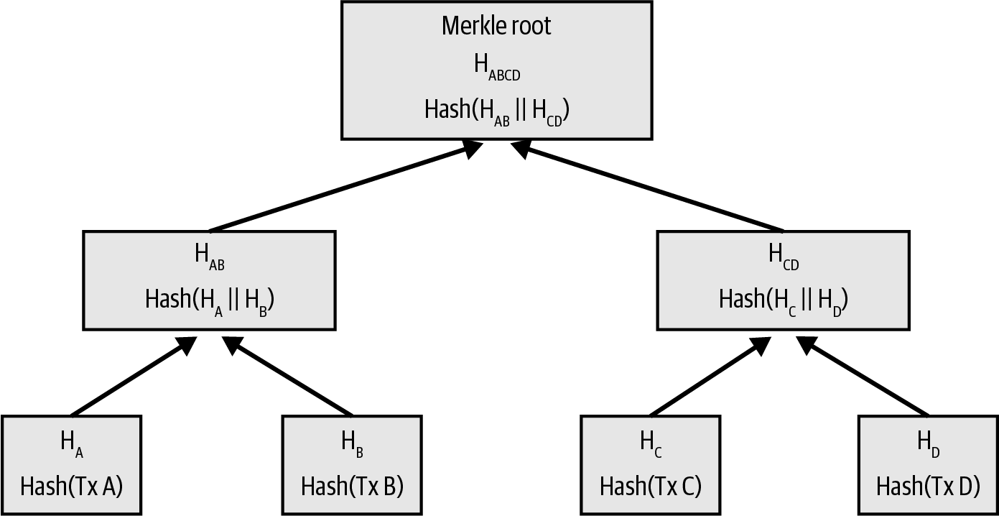

# Mastering Bitcoin (Antonopoulos Book): My Notes

These a re my notes of the book **"Mastering Bitcoin", by A. Antonopoulos (O'Reilly)**.

Although I follow the general structure of the book, I have modified/extended some sections, e.g., using `bitcoin-cli` in a toy node, adding self-made diagrams, re-framing some explanations, etc.

Mikel Sagardia, 2020.  
No guarantees.

## Chapter 1: Introduction

The book has its own repository:

[Mastering Bitcoin Book GitHub Repository](https://github.com/bitcoinbook/bitcoinbook)

I have used some of the media and material in that repository in my notes/summary.

### Setup a Node

To test many things explained in the book it is helpful to have a node up and running. To see how to set up a node, check the co-located guide [`../bitcoin_practical/Bitcoing_Practical_Guide.md`](../bitcoin_practical/Bitcoing_Practical_Guide.md). Example nodes easy to setup using a Raspberry Pi:

- [MyNode](https://mynodebtc.github.io)
- [Umbrel](https://umbrel.com)

## Chapter 2: How Bitcoin Works

### Basics

Bitcoin system consists of:

- Wallets containing keys that can sign transactions.
- Transactions that are propagated across the network, peer-to-peer, without central "authority".
- Miners who produce (through competition) the consensus blockchain; every 10 minutes approximately miners compete for solidifying a block of transactions. The difficulty of the mining activity needs to be adjusted so that the 10 minute block time is maintained constant regardless of the number of miners in the system.

Bitcoin is not only a digital currency, it's also a network that solves the trust problem without centralized agents that provide it.

Some other properties of Bitcoin:

- There will be 21 million coins.
- Every block, bitcoin is created and delivered to the miner who won the mining race.
- Every 4 years the block subsidy is halved: that's known as the halving.
- The last coin will be mined around 2140.
- Bitcoin is not anonymous: once an identity is attached to an address, all associated transactions are easy to identify and track.
- There are different types of wallets: Desktop, Mobile, Web, Hardware (cold), Paper (cold), etc.
- There are several types of nodes:
  - Full node: it has an updated, life copy of the blockchain.
  - Lightweight node: Simple-Payment-Verification (SVP) node, which contains part of the blockchain and connects to full nodes to have access to all transactions.
  - Miner node: a node with mining capabilities, often part of a pool.

### Bitcoin Explorers

Example: [Blockchain Explorer](https://www.blockchain.com).

:warning: **IMPORTANT NOTE: Whenever you use an online service, your IP is logged with the info you check! Use the explorer from your node!**

Usage with the transaction `0627052b6f28912f2703066a912ea577f2ce4da4caa5a5fbd8a57286c345c2f2` made by Andreas Antonopoulos:

- `https://www.blockchain.com/btc/tx/<tx-id>`
- `https://www.blockchain.com/btc/tx/0627052b6f28912f2703066a912ea577f2ce4da4caa5a5fbd8a57286c345c2f2`

Better use a **local bitcoin explorer** for our transactions, e.g., the one from MyNode:


### Transactions

Transactions consist of inputs and outputs:

- Inputs = Outputs + Fees
- Inputs: Debits
- Outputs: Credits (receiver, new address)
- Bitcoin addresses transfer value (inputs) to new Bitcoin addresses (outputs).
- A small fee is taken from the inputs, which goes to the node that writes the transaction into the blockchain; so the miner earns the block subsidy and the fees.
- Several inputs and outputs (& addresses) can appear in a transaction.
- Spending = Signing a transaction that transfers value to a new address.
- Inputs contain proof of ownership, independently verifiable.


#### Transaction Chains

- The input values in a transaction know the transaction they come from.
- Previous outputs are divided into:
  - **Spent: Fractions that are used as inputs for successive transactions.**
  - **Unspent: Fractions that are not used (by now) = UTXO.**
- Wallet keys basically unlock the transaction outputs of previous transactions.

#### Making Change

When value is transferred from an address (input) to another (output), if the coins in the input address don't match the transferred value + fees, change is generated and returned to the input wallet, but maybe to a new address. That's the *change address*

#### Common Transaction Forms

1. **Simple Payment**: Alice sends to Bob from an address which contains a large amount.
   - Input 0: From Alice, signed by Alice
   - Output 0: To Bob
   - Output 1: To Alice: Change

2. **Aggregated Inputs**: Alice transfers to Bob a large amount using many addresses with small amounts.
   - Inputs 0 - N: From Alice, signed by Alice
   - Output 0: To Bob

3. **Distributed Outputs**
   - Input 0: From Alice, signed by Alice
   - Outputs 0 - N: To several wallets/addresses

In all those cases, the *fees* are omitted for clarity, but always:

    Inputs = Outputs + Fees

### Constructing a Transaction

A wallet needs:

1. Destination (public) address
2. Amount

to construct the transaction, which **can even happen offline!**

Example of a transaction structure, as returned by the Bitcoin client:

```bash
# Same previous transaction by Antonopoulos
bitcoin-cli getrawtransaction 0627052b6f28912f2703066a912ea577f2ce4da4caa5a5fbd8a57286c345c2f2 true
```

```json
{
  "txid": "0627052b6f28912f2703066a912ea577f2ce4da4caa5a5fbd8a57286c345c2f2",
  "hash": "0627052b6f28912f2703066a912ea577f2ce4da4caa5a5fbd8a57286c345c2f2",
  "version": 1,
  "size": 258,
  "vsize": 258,
  "weight": 1032,
  "locktime": 0,
  "vin": [
    {
      "txid": "7957a35fe64f80d234d76d83a2a8f1a0d8149a41d81de548f0a65a8a999f6f18",
      "vout": 0,
      "scriptSig": {
        "asm": "3045022100884d142d86652a3f47ba4746ec719bbfbd040a570b1deccbb6498c75c4ae24cb02204b9f039ff08df09cbe9f6addac960298cad530a863ea8f53982c09db8f6e3813[ALL] 0484ecc0d46f1918b30928fa0e4ed99f16a0fb4fde0735e7ade8416ab9fe423cc5412336376789d172787ec3457eee41c04f4938de5cc17b4a10fa336a8d752adf",
        "hex": "483045022100884d142d86652a3f47ba4746ec719bbfbd040a570b1deccbb6498c75c4ae24cb02204b9f039ff08df09cbe9f6addac960298cad530a863ea8f53982c09db8f6e381301410484ecc0d46f1918b30928fa0e4ed99f16a0fb4fde0735e7ade8416ab9fe423cc5412336376789d172787ec3457eee41c04f4938de5cc17b4a10fa336a8d752adf"
      },
      "sequence": 4294967295
    }
  ],
  "vout": [
    {
      "value": 0.01500000,
      "n": 0,
      "scriptPubKey": {
        "asm": "OP_DUP OP_HASH160 ab68025513c3dbd2f7b92a94e0581f5d50f654e7 OP_EQUALVERIFY OP_CHECKSIG",
        "desc": "addr(1GdK9UzpHBzqzX2A9JFP3Di4weBwqgmoQA)#ykrtxd0a",
        "hex": "76a914ab68025513c3dbd2f7b92a94e0581f5d50f654e788ac",
        "address": "1GdK9UzpHBzqzX2A9JFP3Di4weBwqgmoQA",
        "type": "pubkeyhash"
      }
    },
    {
      "value": 0.08450000,
      "n": 1,
      "scriptPubKey": {
        "asm": "OP_DUP OP_HASH160 7f9b1a7fb68d60c536c2fd8aeaa53a8f3cc025a8 OP_EQUALVERIFY OP_CHECKSIG",
        "desc": "addr(1Cdid9KFAaatwczBwBttQcwXYCpvK8h7FK)#e6ft626y",
        "hex": "76a9147f9b1a7fb68d60c536c2fd8aeaa53a8f3cc025a888ac",
        "address": "1Cdid9KFAaatwczBwBttQcwXYCpvK8h7FK",
        "type": "pubkeyhash"
      }
    }
  ],
  "hex": "0100000001186f9f998a5aa6f048e51dd8419a14d8a0f1a8a2836dd734d2804fe65fa35779000000008b483045022100884d142d86652a3f47ba4746ec719bbfbd040a570b1deccbb6498c75c4ae24cb02204b9f039ff08df09cbe9f6addac960298cad530a863ea8f53982c09db8f6e381301410484ecc0d46f1918b30928fa0e4ed99f16a0fb4fde0735e7ade8416ab9fe423cc5412336376789d172787ec3457eee41c04f4938de5cc17b4a10fa336a8d752adfffffffff0260e31600000000001976a914ab68025513c3dbd2f7b92a94e0581f5d50f654e788acd0ef8000000000001976a9147f9b1a7fb68d60c536c2fd8aeaa53a8f3cc025a888ac00000000",
  "blockhash": "0000000000000001b6b9a13b095e96db41c4a928b97ef2d944a9b31b2cc7bdc4",
  "confirmations": 574625,
  "time": 1388185914,
  "blocktime": 1388185914
}
```

A wallet connected to a full node knows about all the unspent coins/output; therefore, they can quickly verify any incoming transaction!

**Outputs are created like scripts: Anyone who can provide proof/signature of having the destination wallet receives the coins.**

The peer-to-peer Bitcoin network propagates the transactions: Any node that receives and confirms a transaction immediately forwards it to the nodes connected to it.

**COMMON MISCONCEPTION:** transactions must be confirmed waiting 10 minutes for a new block or 60 minutes (6 blocks):

- Confirmations ensure that the transaction has been accepted by the whole network.
- But, if A pays to B in front of him/her and B receives the transaction notification, there's no need to wait.
- Confirmations are rather for the rest of the network or maybe for huge values.

### Mempool: Memory Pool

Key ideas:

- After a transaction is carried out, it is propagated; each node validates it and it lands into the **mempool (Memory Pool)**, waiting to be confirmed/verified, i.e., waiting to be solidified into a block = mined.
  - **Unverified transaction = unconfirmed transaction** = Transaction that has not been solidified into a block.
  - When a transaction is unverified, it doesn't mean it is not **valid**! Transactions must pass several validation checks before being added to a node's mempool: verifying digital signatures, ensuring that inputs are valid and not double-spent, and checking that the transaction follows the consensus rules. **After validation, the transaction is broadcast to the node's peers**, which will then repeat the process, propagating the transaction through the network.
- Each Bitcoin node maintains its own mempool, so it is not a single, universal pool shared among all nodes.
  - However, there is significant overlap because nodes typically share and propagate transactions they receive, leading to many nodes having similar contents in their mempools.
- To build a block, the node picks transactions from the mempool
  - Transactions are prioritized, among others, according to the fees paid by the senders.
  - The sender selects the amount of fees they are ready to pay.
  - Therefore, since we have a limited block size, if the mempool is full, large fees are going to be promoted.

Typical sizes:

- Size of a transaction: `[250, 500] Bytes`; if complex (many inputs & outputs): `1,000 bytes`.
  - However, since the SegWit, transactions are measured in **virtual bytes** or `vBytes`, being a `vByte` slightly less than a `Byte`. `1 vByte = 1 byte` for non-SegWit transactions. For SegWit transactions, the weight is the sum of the non-witness data and one-quarter of the witness data.
- Fees of a transaction
  - Low Priority: 1-10 sats/byte.
  - Medium Priority: 20-50 sats/byte.
  - High Priority: 50-100+ sats/byte.
  - For a transaction of 250 bytes and a medium fee rate of 30 sats/byte, the fee would be around 7,500 satoshis (0.000075 BTC).
- Size of a block
  - The maximum block size is 1 MB (1,000,000 bytes) for non-SegWit transactions.
  - With SegWit, the effective block size limit is 4 MB in weight units (WU).
- Number of transactions in a block
  - Large, complex: 1,000 to 1,500
  - Small, SegWit: 2,500-3,000
- Number of transactions waiting in the mempool
  - During low activity periods: 1,000-5,000 transactions
  - During high activity or network congestion: 10,000-100,000+


### Bitcoin Mining

- Transactions are propagated through the network and aggregated into blocks, which are included in the blockchain -> this is through mining.
- After a transaction is propagated, each node validates it and it lands into the **mempool**, waiting to be confirmed/verified, i.e., waiting to be solidified into a block = mined.
- Transactions are prioritized, among others, according to the fees paid by the senders.
- Each mining node creates a block to be added by stacking:
  1. Next prioritized transactions.
  2. A reward transaction for itself: aggregated fees for prioritized transactions + new Bitcoin issued.
  3. A fingerprint of the previous block
- And then start guessing a puzzle which is:
  - **Very difficult to guess.**
  - **But very easy to verify.**
  - So, like a sudoku, it's asymmetrically hard to solve/verify.

Therefore:

- Every 10 minutes, all nodes start competing.
- Only the node which first guesses the game writes the block and receives the reward.
- When a node makes the guess, it notifies its peers, and they verify it and start competing for the next block. That way, they have the incentive to accept the correct mined block and start the new race as soon as possible.

The game/value to be guessed is called **Proof-of-Work (PoW)**:

- The header of the block + random number are hashed to obtain a pattern.
- **The random number is the sought value!**

The difficulty of the game is adjusted every 2 weeks depending on the nodes in the network so that the value can be guessed every 10 minutes (= a block is created every 10 minutes).

**Nowadays:**

- ASICs are used: Hardware in which mining algorithms are printed.
- Miners join in mining pools: many miners who share rewards.

**Terms:**

- **Block Height:** Number of blocks since genesis block until block with observed transaction.
- **Block Depth:** Number of blocks from observed block until very last added.

**Some Insights:**

- As blocks pile on each other, they become exponentially harder to falsify/reverse -> more trusted.
  - By convention, a block with 6+ confirmations is irrevocable because it would require much energy to invalidate and recalculate the 6 blocks.
- Blocks can be written into the blockchain only if Proof-of-Work is shown.
- Writing a block means getting the reward.
- **Therefore, we do not need a central authority: distributed nodes compete and respect the easy-to-verify rules.**


### Spending the Transaction

Key Ideas:

- Each Bitcoin client can verify a transaction as valid.
- Full nodes can track the source of funds until the moment in which they were generated.
- SPV nodes (Simplified Payment Verification, or lightweight) can confirm that the transaction is in the blockchain and has several blocks mined after it.

## Chapter 3: Bitcoin Core: The Reference Implementation

[Bitcoin Core GitHub Repository](https://github.com/bitcoin/bitcoin):

- MIT license.
- Originally published by Satoshi Nakamoto, now handled by many other developers.
- Original Bitcoin Core implementation has:
  - Wallet; but better use another one, more secure.
  - Transaction & block validation engine.
  - Full network node.

### Setup a Bitcoin Node

To test many things explained in the book it is helpful to have a node up and running. To see how to set up a node, check the co-located guide [`../bitcoin_practical/Bitcoing_Practical_Guide.md`](../bitcoin_practical/Bitcoing_Practical_Guide.md). Example nodes easy to setup using a Raspberry Pi:

- [MyNode](https://mynodebtc.github.io)
- [Umbrel](https://umbrel.com)

In any case, the book explains how to clone the original repository and compile it:

- Compilation done step by step
- After compilation, we get two main executables:
  - `/usr/local/bin/bitcoind`: The node running all the time
  - `/usr/local/bin/bitcoin-cli`: The client to connect to the node

The node is configured in the configuration file located in `~.bitcoin/bitcoin.conf`

- Choose strong password for RPC
- `bitcoind --help` displays all possible config parameters, like:
  - `datadir`: Where the blockchain data will go
  - `prune`: Delete old blocks
  - `txindex`: Maintain index of transactions (set it to 1 if we want to check any transaction)
  - `maxconnections`
  - ...

After all that, we can **start the Bitcoin node**:

- `bitcoind -daemon`
- Usually, it's set to the start-up files/script

### Bitcoin CLI and API 101

If we have access to a bitcoin node (e.g., with [MyNode](https://mynodebtc.github.io)) we can interact with the Bitcoin client.

To see how to set up a node, check the co-located guide [`../bitcoin_practical/Bitcoing_Practical_Guide.md`](../bitcoin_practical/Bitcoing_Practical_Guide.md).

The Bitcoin CLI is `bitcoin-cli`:

- `bitcoin-cli` is a JSON-RPC interface.
- RPC = Remote Procedure Call.
- That means: `bitcoin-cli` is the client which requests the server `bitcoind` (the node) for info, which is delivered as JSON strings.

Thanks to the RPC Interface, we can access the node via HTTPS protocol:

- For instance using curl or any other tool
- There is an example in the book for that
- Another option is to use libraries that do that
- Or, `bitcoin-cli`

#### Basic `bitcoin-cli` Commands

```bash
# Log in via SSH; we might need to use the local IP
# The IP can be obtained, e.g., with Angry IP Scanner
# Note that we use admin user
# but config stuff for Bitcoin is really
# in /home/bitcoin/.bitcoin
ssh admin@mynode.local

# Help of a command
bitcoin-cli help <command>
bitcoin-cli help getblockhash

# Status of our node
bitcoin-cli getinfo

# Provides information about the current state of the blockchain
bitcoin-cli getblockchaininfo

# Returns information about the network and the connected peers
bitcoin-cli getnetworkinfo

# Returns data about each connected network node
bitcoin-cli getpeerinfo

# Provides mining-related information such as hashrate, difficulty, etc.
bitcoin-cli getmininginfo

# Hexadecimal code of transaction is returned; we need to decode it
bitcoin-cli getrawtransaction <txid>

# JSON string of transaction is returned; we see the values and the addresses in it
bitcoin-cli decoderawtransaction <tx-hex>

# Gets the raw transaction data for a given transaction ID
# true: decode hexstring
bitcoin-cli getrawtransaction <txid> true

# Hash of block with index 1000, we need to decode it; the index or id is called the height
bitcoin-cli getblockhash 1000

# JSON string of block returned; here, we can see all the transactions of the block and follow the transactions
# We can increase the verbosity to get also all the tx information (inputs and outputs, etc.)
bitcoin-cli getblock <block-hash>

# JSON string with the block header (useful for SPVs)
bitcoin-cli getblockheader <block-hash>

# Get mempool info: general stats
bitcoin-cli getmempoolinfo

# List Transactions in Mempool: all the txids waiting to be mined
bitcoin-cli getrawmempool

# Get Detailed Information on a Specific Mempool Transaction
bitcoin-cli getmempoolentry <txid>

# Provides information about the wallet, including balance, etc.
bitcoin-cli getwalletinfo

# Generates a new Bitcoin address for receiving payments
bitcoin-cli getnewaddress

# Lists the most recent transactions in the wallet
bitcoin-cli listtransactions

# Lists unspent transaction outputs in the wallet
bitcoin-cli listunspent

# Private key is generated and address returned
bitcoin-cli getnewaddress # <address>
# If we input our generated address, wallet is opened and its private key is returned
bitcoin-cli dumpprivkey <address>
# Note: we cannot obtain the private key of an arbitrary address,
# but open the wallet and return the private key

# Testnet: Dev/Test environment with parallel blockchain which is reset (to remove value to coins) every now and then
# Once downloaded, we can use the same commands, but with the -testnet switch
bitcoind -testnet # Creates `~/.bitcoin/testnet3` and blockchain starts downloading there
bitcoin-cli -testnet getinfo
bitcoin-cli -testnet getblockchaininfo
```

There are much more commands, among others, we can interact with the wallet programmatically: receive, send, etc.

#### Enable RPC Access in Node

In addition to logging via SSH to the node and running `bitcoin-cli` on the node, we can also make use of the RPC functionality, i.e., we can query from another computer (in the same network) using cURL or dedicated libraries.

To enable TPC access, we need to modify the `/home/bitcoin/.bitcoin/bitcoin.conf` file in the node to contain:

```makefile
rpcuser=yourrpcusername         # Select one
rpcpassword=yourrpcpassword     # Select one
rpcallowip=192.168.1.0/24       # Adjust this to match your local network
rpcbind=0.0.0.0                 # Bind to all network interfaces
rpcport=8332                    # Default RPC port for Bitcoin
```

Then, in our local computer, we can create a `.env` file which contains the values of 

- `RPC_USER`: either we define it or take the one in `bitcoin.conf`
- `RPC_PASSWORD`: either we define it or take the one in `bitcoin.conf`
- the IP of our node, e.g., `BTC_NODE_IP`: we can scan our local network, e.g., with Angry IP Scanner
- `RPC_PORT`: default 8332

**If we have a MyNode, all that is already configured** and we can access the values of `rpcuser` and `rpcpassword` from the web UI:

- Open Web UI: `https://BTC_NODE_IP`; username + PW (not RPC)
- Bitcoin app: `Manage`
- Info Tab: RPC Username, RPC Password (show)


#### Examples in Python

There are many libraries which interact with the RPC, e.g., for Python: [python-bitcoinlib GitHub Repository](https://github.com/petertodd/python-bitcoinlib).

Notebook: [`Bitcoin_API_Examples.ipynb`](./Bitcoin_API_Examples.ipynb).  
Three examples shown in the book using `python-bitcoinlib`:

1. Get number of blocks so far
2. Get outputs of a transaction
3. Get all the outputs of all transactions in a block

Environment setup:

```bash
conda env create -f conda.yaml
conda activate btc
```

Code summary:

```python
### -- 0. Connect to Node via RPC

import os
from dotenv import load_dotenv
from bitcoin.rpc import RawProxy

# Load environment variables from .env file
load_dotenv()

# Retrieve environment variables
rpc_user = os.getenv('RPC_USER')
rpc_password = os.getenv('RPC_PASSWORD')
rpc_ip = os.getenv('BTC_NODE_IP')
rpc_port = os.getenv('RPC_PORT')

# Create the connection URL
# We pass username + PW here!
rpc_url = f"http://{rpc_user}:{rpc_password}@{rpc_ip}:{rpc_port}"

# Create a connection to the Bitcoin Core node
try:
    p = RawProxy(service_url=rpc_url)
except Exception as e:
    print(f"An error occurred: {e}")

### -- 1. Get number of blocks so far

# Run the getblockchaininfo command, store the resulting data in info
info = p.getblockchaininfo()
# Retrieve the 'blocks' element from the info
print(info['blocks']) # 851989

### -- 2. Get outputs of a transaction

# Alice's transaction ID
txid = "466200308696215bbc949d5141a49a4138ecdfdfaa2a8029c1f9bcecd1f96177"

# First, retrieve the raw transaction in hex
raw_tx = p.getrawtransaction(txid)

# Decode the transaction hex into a JSON object
decoded_tx = p.decoderawtransaction(raw_tx)

# Retrieve each of the outputs from the transaction
for output in decoded_tx['vout']:
    print(output['scriptPubKey']['address'], output['value'])
    # bc1p8dqa4wjvnt890qmfws83te0v3qxzsfu7ul63kp7u56w8qc0qwp5qv995qn 0.00020000
    # bc1qwafvze0200nh9vkq4jmlf4sy0tn0ga5w0zpkpg 0.00075000

### -- 3. Get all the outputs of all transactions in a block

# The block height where Alice's transaction was recorded
blockheight = 775072

# Get the block hash of the block at the given height
blockhash = p.getblockhash(blockheight)

# Retrieve the block by its hash
block = p.getblock(blockhash)

# Element tx contains the list of all transaction IDs in the block
transactions = block['tx']

block_value = 0

# Iterate through each transaction ID in the block
for txid in transactions:
    tx_value = 0
    # Retrieve the raw transaction by ID
    raw_tx = p.getrawtransaction(txid)
    # Decode the transaction
    decoded_tx = p.decoderawtransaction(raw_tx)
    # Iterate through each output in the transaction
    for output in decoded_tx['vout']:
        # Add up the value of each output
        tx_value = tx_value + output['value']

    # Add the value of this transaction to the total
    block_value = block_value + tx_value

print("Total value in block: ", block_value) # 5863.00566521

```

## Chapter 4: Keys, Addresses

**Important note**: Bitcoin communication & data are not encrypted!

- We have three main elements which establish the ownership of bitcoins:
  1. **Digital or Private Keys**
     - Not stored on the network, but in the wallets.
     - Used to create identity signatures: we can spend *satoshis* linked to an address if we show the signature of the private key.
     - Used to create public keys.
     - They can be generated and managed without access to the blockchain!
     - So, used to spend funds, it's like the PIN.
  2. **Public Keys**
     - Created from the private key: easy to create and verify, but impossible to get original private key.
     - Used to receive funds.
  3. **Addresses**
     - Hashed public keys.
     - Usually, the elements used to send/receive.
     - Behind an address we can have a wallet or a script.

### Public Key Cryptography** (Not in the Book)

[Public Key Cryptography Explanation](https://www.youtube.com/watch?v=AQDCe585Lnc&vl=en)

We have two main types of encryptions approaches:

1. **Symmetric**
   - Create a key/password used to encrypt content.
   - Same key used to decrypt content.
   - Issue: sharing the key can be unfeasible or dangerous.
2. **Asymmetric**
   - Create a key pair: private and public key.
     - Private key (`PrivK`) is kept private, never shared.
     - Public key (`PubK`) is shared with all peers.
   - If a peer wants to send content, they encrypt it with the public key of the receiver.
   - Receiver decrypts it with the linked private key.

Thus, in asymmetric cryptography, another person encrypts a message for us with OUR public key (`PubK`) and we decrypt it with our private key (`PrivK`).
However, note that in Bitcoin we use **digital signatures** based on asymmetric cryptography; these work in practice in a different way:
We create a signature with our message and our `PrivK` and the receiver gets both the message and our `PubK`.
Then, the receiver verifies that the message is correct using 

- the `PubK`,
- the signature,
- and the message.

More on digital signatures in the section [Digital Signatures](#digital-signatures).


Further notes on **Asymmetric Encryption**:

- Key private-public key pair is linked, but:
  - We derive the public key from the private one.
  - We cannot obtain the private key from the public one.
- Private key decrypts content encrypted only by its linked public key.

Applications using **Asymmetric Encryption**:

1. **HTTPS (SSL)**
   - Web owner pays an authority to keep a private key of the website.
   - When visiting the web, the browser gets the public key of the web and the address of the authority.
   - The web provides a message from the authority encrypted with the public key.
   - Authority decrypts the message; if correct, the web's identity is verified.
2. **Bitcoin**
   - Verify ownership of funds by decrypting a message encrypted with the address/public key.
3. **SSH**
   - Similar to HTTPS to verify identities.
4. **PGP or GPG**
   - Pretty Good Privacy: asymmetric encryption for emails/messages.
   - Install on Thunderbird or use GPG Keychain application.
   - Alternatively, use command line tool to do everything manually.
     - [GPG Command Line Guide](https://blog.ghostinthemachines.com/2015/03/01/how-to-use-gpg-command-line/)
     - Install with:
        ```bash
        brew install gnupg
        sudo apt-get install gnupg
        gpg --gen-key
        ...
        ```

### Private & Public Keys

The process to obtain an address from a private key is as follows:

    Private key (k) -> (elliptic curve multiplication) -> Public key (K) -> (hashing) -> Bitcoin Address (A)

It **can only go one way, not back!**

Key ideas:

- We need a (spend) signature to unlock the funds associated to an address.
- That (spend) signature can be generated only with the private key but can be verified by the public key available to anyone.
- Private key is a random number of 256 bits: `2^(256)`
  - Usually encoded in:
    - Hexadecimal: base 16 = base 4 bits = 2^4
    - Base58: base 64 - 6 characters difficult to distinguish

How to obtain the private key of an address using `bicoin-cli`:

```bash
# Private key is generated and address returned
bitcoin-cli getnewaddress # <address>
# If we input our generated address, wallet is opened and its private key is returned
bitcoin-cli dumpprivkey <address>
# Note: we cannot obtain the private key of an arbitrary address,
# but open the wallet and return the private key
```

### Public Keys Created by Elliptic Curve Multiplication

As introduced, public keys are generated from private keys; that is done via elliptic curve multiplication, and the process is irreversible (i.e., we cannot obtain back the private key from the public one).

Key ideas:

- Elliptic curve multiplication is irreversible
- Elliptic curve: `y^2 = x^3 + 7` discretized
  - Symmetric on `x`.
  - Coordinates `(x, y)`: each point is a possible key of all possible `2^256`.
    - How do we map a 1D number to 2D? We don't really need... since the elliptic curve is symmetric, we just need `x` and the sign of `y`!
    - In practice, `x` and `y` each has 256 bit, and we use the compressed version, which is `x` and the sign codified as a prefix; explained below.
  - Addition operation of points `P1` & `P2` of the curve is defined as follows:
    - Draw a line between `P1` & `P2` and where it intersects, we have `P3'`.
    - Reflect its y value, we have `P3`, the result.
  - Multiplication is defined as a sum:
    - `k * P = P + P + P + ...`, k times
    - Adding a point `P` to itself is basically throwing the tangent line and reflecting the intersection point.
  - Public key (K) created by elliptic curve multiplication:
    - `K = G * k`
      - K: Public key (result)
      - G: Generator point `(x,y)`, same and known to everyone
      - k: Private key


Then, **Bitcoin Addresses** are obtained from the public key:

- Bitcoin address can be:
  - Owner of a private key
  - Payment script
- Address created by double-hashing the public key with the algorithms `SHA256` and `RIPEMD160`:
  ````
  A = RIPEMD160(SHA256(K))
  ```

Notes on the **encoding**:

- Base58: Base64 - 6 symbols difficult to distinguish = `0-9, a-z, A-Z - (0, O, l, I)`
- Base58Check: Base58 with additional checksum at the end; prefix to denote it's a Base58Check address
  - Prefix 1: Bitcoin address
  - Prefix 3: Payment address

### Key Formats

**Private Key Formats:**

- Raw: 32 bytes
- Hex: 64 hexadecimal digits
- WIF = Wallet Import Format = Base58Check: prefix 5
- WIF-compressed = Prefix K or L, suffix 0x01 (this hexadecimal suffix is converted to Base58Check)
  - Note: WIF-compressed are not really compressed, it means they should be used to derive compressed public keys

**Public Key Formats:**

- Public keys can be compressed/uncompressed
- Recall a public key is a point (x,y) in the elliptic curve
  - Since the elliptic curve is symmetric in x, we just need x and the sign of y!
- Uncompressed Public Key Format:
  - `04 x y`
  - `04`: Prefix
  - `x`: 256-bit x coordinate of the point on the elliptic curve
  - `y`: 256-bit y coordinate
- Compressed Public Key Format:
  - `02 x` (y positive, even)
  - `03 x` (y negative, odd)
- Notes:
  - If we hash a compressed or uncompressed key, the result is different!
  - However, the private key is the same!
  - To enable compatibility, private keys have a suffix `0x01` when they need to be used to generate compressed public keys
    - That's the WIF-compressed format = Base58Check + suffix `0x01` (hexadecimal)

### Advanced Keys and Addresses

**Encrypted Private Keys (BIP-38):**

- BIP = Bitcoin Improvement Proposal.
- Private keys encrypted with a passphrase (password) - we need that password to decrypt them again.
- The result is a private key in Base58Check that begins with `6P`.

**Pay-to-Script Hash (P2SH) and Multisig Addresses:**

- Bitcoin addresses which begin with `3` designate a script as the beneficiary.
  - The script specifies the conditions to spend the funds.
- Most common implementation: *Multisignature* address script:
  - Script requires M signatures of N>=M to prove ownership and spend funds.

**Vanity Addresses:**

- Addresses that contain human-readable parts, e.g., 1Love...
- Generated by testing random private keys until the desired pattern appears
- Pattern of 4 symbols can be found in ~1 minute
- Pattern of 10 requires ~46,000 years

**Paper Wallets:**

- Very good for cold storage.
  - *IMPORTANT: Can deposit several times, BUT should withdraw only once!*
    - Reason: Sometimes change addresses are created.
- Sometimes keys are encrypted and need a passphrase to decrypt them.
- Generate paper wallets here:
  - [bitaddress.org](https://bitaddress.org): We can save the page and generate paper wallet offline.
  - [bitcoinpaperwallet.com](https://bitcoinpaperwallet.com)

### Code Examples

- **C++ Example:** Generation of private key and an address from it (p. 69)
- **Python Example:** Generation of private key and an address from it using `pybitcointools` by Vitalik Buterin (p. 77)


## Chapter 5: Wallets

Wallets are the primary user interface; their main goal is to safely keep private keys.

- Wallets do not contain bitcoins.
- Bitcoins are mere transaction outputs on the blockchain.
- Wallets just contain the keys to spend them.

There are two main types of wallets:

1. **Non-deterministic Wallets:**
   - Just random private keys created and stored.
   - Not common anymore, discouraged.

2. **(Hierarchical) Deterministic Wallets (HD):**
   - They contain private keys derived from a seed, using one-way hashing.
   - With the seed, all private keys can be generated (which are many).

### HD Wallets (BIP-32, BIP-44) = Hierarchical Deterministic Wallets

Key ideas:

- All private keys contained by the wallet derived from a seed in a tree structure.
  - Each child of a parent node becomes a parent that can create children, and so on
- Advantages:
  - Tree structure can be used to give meaning to subsets/branches, e.g., departments, etc.
  - **VERY IMPORTANT:** It is possible to create the public keys of the tree without having the private keys!


**Mnemonic Codes Used to Generate 512-bit Seeds (BIP-39):**

Usually, to create the seed, we use a fixed set of words:

- Mnemonic codes are easy-to-remember words.
- 12-24 English words, each from a dictionary of 2024 words
  - 2024 = 2^11 = 11 bits
- When we start/create a wallet with the latest standard, it generates a RANDOM bit-string encoded in 12 words.
- From these 12 words, we can create an endless number of private and public keys.
- Mnemonic words + *salt* are stretched using a special cryptographic function up to a 512-bit seed
  - Salt is the string `"mnemonic"` + *optional passphrase*, adding extra security.
    - Example: Write down the 12 words for backup, but not the passphrase.
- **Recall:** A private key is `256-bits (2^256) <<< 512-bits (2^512)`

**Creating an HD Wallet from the Seed:** 

Seed is hashed to a 512-bit string and

- Left 256 bits: Master private key (m).
- Right 256 bits: Master chain code (c).
- Chain code introduces entropy when creating child keys from parent keys.

**Creating Child Keys:** 

Each child key is created with:

- Parent private/public key (256 bits)
  - If private, private child key created; public otherwise
- Parent chain code (256 bits)
- Index number of 32 bits: `0, 1, ... 2^32`
- All three are mixed and hashed to create children keys
- Index allows to create `2 x 2^31` children keys
  - Half are normal derivation keys: `2^31 = 2147 million`.
  - The other half hardened keys: `2^31 = 2147 million`.

**Extended Keys:**

Extended keys are the combination of the private/public key + chain code and they can create all possible children keys alone!

- Public: Start with `xpub...`
- Private: Start with `xpriv...`

IMPORTANT properties of the extended keys:

- Possible to create public child keys without private parent keys, just with the public parent keys!
  - Be careful: Entire transaction history becomes public when we publish provide the `xpub`.
  - Interesting applications:
    1. Upload `xpub` to a web/e-commerce application and use it without private keys online!
    2. Have an offline paper wallet and generate public keys for it without putting the wallet online!
- Hardware wallets never export private keys unless explicitly done.

**Hardened Child Keys:**

In order to break the connection, the parent private key is used to derive the child public key.
This way, we can have an `xpub` branch that is not connected to any other; that means more security and privacy.
Therefore, hardened key derivation creates a gap.

With the 32-bit index, we create 2^32 children keys: 2 x 2^31:

- 0 to 2^31-1: Normal derivation children keys
- 2^31 to 2^32 - 1: Hardened children keys

**HD Wallet Identifier Paths: Keys Denoted with a Path:**

Keys in a HD wallet are identified using a path naming convention, separating tree levels by `/`:

- `M/x/y/z`: Public keys derived from master *public* key
- `m/x/y/z`: Private keys derived from master *private* key
  - `m/0`: First child (`0`) private key of the master private key
  - `m/0/0`: First grandchild private key of the first child (`m/0`)
  - `m/0'/0`: First normal grandchild  of the first hardened child (`m/0'`)
  - `m/0/1`: Second child (`1`) of the first child
- Tree can be as deep as desired, with each step creating 4 billion children: 2 normal, 2 hardened
- **BIP-44 Proposed Convention:**
  - `m / purpose' / coin_type' / account' / change / address_index`
    - m / 44': Follows BIP-44 convention
    - m / 44' / 0': Bitcoin
    - m / 44' / 1': Bitcoin testnet
    - m / 44' / 2': Litecoin
  - Several accounts in the wallet related to Bitcoin
  - For each account, have change addresses for the transaction change

### Final Remarks

Important concepts:

- Asymmetric cryptography
- 256-bit mnemonic seeds
- Private key (k) -> (elliptic curve multiplication) -> Public key (K) -> (hashing) -> Bitcoin Address (A)
- Extended public and private keys (`xpub`, `xpriv`)
  - It's possible to create public child keys without private parent keys, just with the public parent keys!
  - BUT: be careful, that involves security/privacy risks, because all public keys get exposed.
- We cannot create many addresses from a public key, but just one; in contrast, we can create many public keys from a master key (4k million), which makes possible to get many addresses (4k million), one from each public key.

## Chapter 6: Transactions

Transactions are public entries in the blockchain in which value transfers between participants are encoded. Although explorers and other interfaces show many fields for a transaction (e.g., addresses), these are high-level constructions that are not really in a transaction.

A transaction encoded in the blockchain has these fields:

- **vin**: Inputs (where the value goes to)
  - `txid`: Reference to the transaction that contains the UTXO being spent.
    - The index `vout` of the UTXO in that transaction.
    - We need to go to the referenced transaction and check the UTXO to see the value being spent!
  - `scriptSig`: Unlocking script that gives access to the funds to be spent.
    - CONTAINS the address (public key hash) of the receiver.
  - `sequence`
- **vout**: Outputs (where the value comes from)
  - `values`: Amounts
  - `scriptPubKeys`: Locking script that locks the funds to be spent
    - USES the signature and the public key of the wallet from which we'd like to spend

Example: Transaction with txid `466200308696215bbc949d5141a49a4138ecdfdfaa2a8029c1f9bcecd1f96177`.


Equivalent JSON transaction information:

```json
{
    "txid": "466200308696215bbc949d5141a49a4138ecdfdfaa2a8029c1f9bcecd1f96177",
    "hash": "f7cdbc7cf8b910d35cc69962e791138624e4eae7901010a6da4c02e7d238cdac",
    "version": 1,
    "size": 194,
    "vsize": 143,
    "weight": 569,
    "locktime": 0,
    "vin": [
        {
            "txid": "4ac541802679866935a19d4f40728bb89204d0cac90d85f3a51a19278fe33aeb",
            "vout": 1,
            "scriptSig": {
                "asm": "",
                "hex": ""
            },
            "txinwitness": [
                "cf5efe2d8ef13ed0af21d4f4cb82422d6252d70324f6f4576b727b7d918e521c00b51be739df2f899c49dc267c0ad280aca6dab0d2fa2b42a45182fc83e8171301"
            ],
            "sequence": 4294967295
        }
    ],
    "vout": [
        {
            "value": 0.0002,
            "n": 0,
            "scriptPubKey": {
                "asm": "1 3b41daba4c9ace578369740f15e5ec880c28279ee7f51b07dca69c7061e07068",
                "desc": "rawtr(3b41daba4c9ace578369740f15e5ec880c28279ee7f51b07dca69c7061e07068)#38d6v6ev",
                "hex": "51203b41daba4c9ace578369740f15e5ec880c28279ee7f51b07dca69c7061e07068",
                "address": "bc1p8dqa4wjvnt890qmfws83te0v3qxzsfu7ul63kp7u56w8qc0qwp5qv995qn",
                "type": "witness_v1_taproot"
            }
        },
        {
            "value": 0.00075,
            "n": 1,
            "scriptPubKey": {
                "asm": "0 7752c165ea7be772b2c0acb7f4d6047ae6f4768e",
                "desc": "addr(bc1qwafvze0200nh9vkq4jmlf4sy0tn0ga5w0zpkpg)#qq404gts",
                "hex": "00147752c165ea7be772b2c0acb7f4d6047ae6f4768e",
                "address": "bc1qwafvze0200nh9vkq4jmlf4sy0tn0ga5w0zpkpg",
                "type": "witness_v0_keyhash"
            }
        }
    ],
    "hex": "01000000000101eb3ae38f27191aa5f3850dc9cad00492b88b72404f9da135698679268041c54a0100000000ffffffff02204e0000000000002251203b41daba4c9ace578369740f15e5ec880c28279ee7f51b07dca69c7061e07068f8240100000000001600147752c165ea7be772b2c0acb7f4d6047ae6f4768e0141cf5efe2d8ef13ed0af21d4f4cb82422d6252d70324f6f4576b727b7d918e521c00b51be739df2f899c49dc267c0ad280aca6dab0d2fa2b42a45182fc83e817130100000000",
    "blockhash": "000000000000000000027d39da52dd790d98f85895b02e764611cb7acf552e90",
    "confirmations": 95476,
    "time": 1675559245,
    "blocktime": 1675559245
}
```

IMPORTANT:

- The unlocking and locking scripts are executed in sequence; if successful (i.e., wallet proves it is owner of private-public key assigned to funds), the transaction is integrated into the blockchain.
- Every node needs to confirm the transaction.

### UTXOs

UTXO = Unspent Transaction Output = vout.

- Indivisible chunks of bitcoin recorded in the blockchain that are waiting to be spent.
  - Outputs are INDIVISIBLE and, if INTEGERS = measured in satoshis
  - INDIVISIBLE means: an UTXO can be consumed only in its entirety; if amount sent doesn't match, need to either:
    - Gather several UTXOs.
    - Generate change.
    - Wallets automatically handle this; if programming, need to code it!
- Bitcoin nodes track them; there is a UTXO set.
- When a transaction is executed, funds from the UTXO set are transferred, and the set is changed.
- Wallets select UTXOs they control to form the transaction.
- Transactions are serialized into a byte-stream to transmit them.

### Fees

Transactions have implicit fees = sum(Inputs) - sum(Outputs).

- Fees are not explicitly in the I/O values but derived from subtraction: sum(Inputs) - sum(Outputs).
- **Exception: Coinbase Transaction:**
  - First entry in each blockchain block.
  - No UTXO inputs are consumed, but the winning miner node is rewarded with new generated satoshis.
  - This input is called coinbase.
- We need to go to the referenced inputs (spent UTXOs) to compute the fees.
- Wallets usually compute fees automatically:
  - A value of satoshis/byte is chosen, and the final value depends on the size of the transaction (not the value sent).
  - Fees are not mandatory, but transactions with higher fees are prioritized, as miner nodes select them from the mempool since they can get the fees.
  - To check current fees of unconfirmed transactions:
    - [Bitcoin Fees](https://bitcoinfees.earn.com)
    - `curl https://bitcoinfees.21.co/api/v1/fees/recommended`

Fees Have Two Functions:

1. Compensate bitcoin miners for securing the network.
2. Make it economically infeasible to flood the network with useless transactions.

### Transaction Scripts and Script Language

As introduced above, transactions contain scripts.

Transactions use a script language called *"Script"*:

- It is very simple.
- It's a Turing-incomplete language: no loops (to avoid infinite loops).
- All information necessary is in the scripts.

We have an **unlocking** script part (of the used UTXOs) and a **locking** script part (which assigns the funds to an address).

- Both parts are executed sequentially - if the result is true, the transaction is successful.
- It enables a programmable money for which we can script infinite variations and sets of conditions that need to yield true.
- These are **SMART CONTRACTS**: Transaction happens if script conditions are met, whatever these conditions are.

*Script* Language works as follows:

- Operations and variables are sequentially stacked into a stack in LIFO order: one on top of the other
- **Typical Operations:**
  - `ADD`: Last (top) two popped from stack, sum added to stack
  - `DUP`: Duplicate last (top) stack element and push it
  - `EQUAL`: Pop last (top) two and push TRUE if both are equal, else FALSE
  - ...

Example of a script pair (unlocking + locking) run in sequence and some exemplary components:

```
Unlocking script                Locking script
scriptSig                       scriptPubKey
We provide proof to spend       Our wallet has the funds to be spent
--------------------------      -------------------------------------------
<sig> <PubK>                +   DUP HASH160 <PubKHash> EQUALVERIFY CHECKSIG
--------------------------      -------------------------------------------

<sig>: signature of the wallet that wants to spend added to stack.
  The signature is created with the message (transaction) and the private key.
  It can be checked it was created by the PrivK by using the PubK.
  That is the main idea!

<PubK>: public key of the wallet that wants to spend added to stack.

DUP: push top element <PubK> to the stack.
  Now, stack is:
    <PubK>
    <PubK>
    <sig>

HASH160: it hashes the top element in the stack and pushes it:
  hash(PubK) = PubKHash = Address.

<PubKHash>: PubKHash = Address pushed to the stack.
  Now, stack is:
    <PubKHash>
    <PubKHash>
    <PubK>
    <sig>

EQUALVERIFY: 2 top items of stack popped and checked if equal; execution continues if true.
  Basically, we check that the wallet that wants to spend is providing the PubK that matches with the address that has the UTXO funds.
  If equal, stack is:
    <PubK>
    <sig>

CHEKCSIG: finally, <PubK> and <sig> are popped and the signature verification algorithm checks that <sig> is valid for <PubK>.
  If true, tx (transaction) is valid.
  The signature is created with the message (transaction) and the private key.
  It can be checked it was created by the PrivK by using the PubK.
  That is the main idea!
```

### Digital Signatures

In asymmetric cryptography, another person encrypts a message for us with OUR public key (`PubK`) and we decrypt it with our private key (`PrivK`).
BUT for digital signatures we use the `PrivK` and `PubK` the other way around:

- Create a unique digital signature with the message (transaction) and the PrivK:
  ```
  signature <- cryptography(message + `PrivK`)
  ```
- Send to the network nodes (or to the other party):
  - The signature.
  - Our `PubK`.
  - The message = the transaction.
- Any node can verify with our `PubK` and the message that the signature was created with the `PrivK` pair.

As a consequence, digital signatures achieve the following:

1. Authenticate the sender or owner of funds (authentication).
2. Proof that the sender cannot deny having sent the message/transaction (nonrepudiation).
3. Proof that the message has not been altered (integrity).


### Common Transactions and Strange Transactions

- Most common transactions (~80%) are **P2PKH** = pay to public key hash (an address = PubK hash).
- The rest are called *"strange transactions"*; they simply have another type of locking/unlocking script.
- Sometimes, blockchain explorers mark *"strange transactions"* in red as strange and make the warning that they cannot decode them - it's really nothing wrong with them, they simply are not P2PKH.

## Chapter 7: Advanced Transactions and Scripting

Apart from the most common **P2PKH** (pay to public key hash, i.e., an address), there exist other transactions, too.

Note that the *Script* scripting language is very rich and has many operators with their fields.

### Multisignature Scripts

- N `PubK` are recorded and at least M of those must provide signatures to unlock the funds.
- Due to a bug, these scripts start with 0, which solves the bug by consensus.

### Pay-to-Script-Hash (P2SH)

- Multisig transactions make the scripts (thus, also transactions) longer and more complex.
  - Recall: The fee is proportional to the size of the transaction.
- Workaround: Pay to a redeem script hash and this script needs to unlock the funds later.
  - Effect: The burden of the fees and the complexity of the script is shifted to the recipient (spender) of the transaction.
- How it Works: Script is hashed to create an address, and bitcoins are sent to that address.
  - Commonly used with multisignature transactions.
  - P2SH addresses start with 3.

### Data Recording Outputs

- It is possible to record data in the blockchain, e.g., a digital fingerprint of a file as proof-of-existence on a date.
- These transactions do not involve spending bitcoins.
- Issue: Blockchain bloat - they create UTXOs that cannot be spent.
  - Solution: RETURN operator introduced: these transactions don't land in the UTXO memory pool.
    - If `OP_RETURN` comes up in the script, 0 bitcoin UTXO is generated and we get FALSE and halt

### Timelocks

Timelocks are restrictions on transactions or outputs that only allow spending after a point in time.

There are two types or levels of implementation:
  
1. Through transaction field `nLocktime`.
2. With operator `CHECKLOCKTIMEVERIFY`.

#### `nLocktime`

- Custom field in the transaction: `nLocktime`
  - If 0, immediate propagation.
  - If < 500 million, interpreted as block height.
  - If > 500 million, Unix Epoch time = seconds since Jan-1-1970.
- Problem: Double-spending becomes possible; example:
  - Alice sends a transaction to Bob with `nLocktime = now + 3 months` (spendable in 3 months).
  - Bob gets the transaction but can't use it immediately; he can spend the bitcoins in it after 3 months.
  - BUT: Alice can create another transaction that spends those bitcoins!

#### `CHECKLOCKTIMEVERIFY` (CLTV)

- Introduced in December 2015 (BIP-65).
- Solution to Double-Spending: Operator takes time value as parameter in the same format as `nLocktime`.

### Relative Timelocks

Relative timelocks specify an elapsed time from the confirmation of the output as a condition of spending it:

- Transaction is done, and the UTXO is confirmed in the blockchain.
  - Relative Timelock: Specifies elapsed time from confirmation as condition for spending the UTXO.
  - Clock starts ticking when UTXO is recorded in the blockchain.
- Use Case: Allow a chain of 2+ interdependent transactions to be held off-chain.
  - **Essential for technologies like the Lightning Layer:** Bidirectional state channels.

Relative timelocks are/can be implemented in two ways/levels:

1. At transaction level, using the field `nSequence`.
   - Note: Originally `nSequence` intended to allow modification of transactions in the mempool, but never used like that.
2. Script operator level, with operator `CHECKSEQUENCEVERIFY`.

Notes about time synchronization:

- Bitcoin is a decentralized network: each participant has its own perspective of time.
- But, eventually, everything is synced every 10 minutes (new block).
- Possible malicious actions could be exploited, though.
  - Solution: Consensus rules.
    - Example: Median-Time-Past: Median of the last 11 blocks (time ~1 hour behind).
    - Issue: Not fully understood.

### Scripts with Flow Control

It is possible to build scripts with flow control, i.e., `IF .. ELSE .. ENDIF`:

- Unlimited nested conditions become possible with them, but consensus rules limit script size.
- Build redeem scripts with conditions, e.g., two signers, either one can redeem.

## Chapter 8: The Bitcoin Network

Bitcoin is structured as a Peer-to-Peer (P2P) network on top of the Internet:

- All peers are equal; no special nodes.
- No hierarchy; flat topology.
- Other P2P examples: Napster, BitTorrent.

In addition to the P2P protocol, other protocols coexist within Bitcoin:

- Stratum: Used by mining pools.
- Lightweight wallet protocols (SPV = Simplified Payment Verification).
- Other mining pool protocols

All those protocols together form the **extended bitcoin network**.

### Types of Nodes

Nodes can have several modules (i.e., functionalities) -- or not:

- **Wallet:** Keys stored and the ability to sign & spend.
- **Mining:** New blocks are written to the blockchain and new bitcoins rewarded.
- **(Full) Blockchain:** Full history of transactions.
- **Network Routing:** Transactions and any other information propagated to connected peers.

According to the functionalities they have, we distinguish different types of nodes:

- **Full Nodes:**
  - Have the full blockchain and can autonomously verify any transaction without external reference.
  - Usually wallets that can verify by themselves.
- **Mining Nodes:**
  - Don't need the full blockchain.
  - Compete to create new blocks to solve the Proof-of-Work algorithm.
  - Usually run on specific hardware and often grouped in pools.
- **SPV Nodes (Simplified Payment Verification, aka. Lightweight Nodes):**
  - Don't have the full blockchain but a subset (headers).
  - Request information with privacy techniques to complete the view of the blockchain they need.
  - Usually mobile lightweight wallets.
- **Edge Routers:**
  - Full nodes without wallet.
  - Verify and propagate transactions.
  - Use case: Explorers, exchanges.

### Bitcoin Relay Networks

There exist Bitcoin relay networks to allow for faster transfer of network information, useful for mining applications, where mining nodes compete with each other (thus, latency is an issue).

- Issue: Main P2P bitcoin network has too high latency for specialized needs of mining nodes.
- Solution: Relay networks
  - Like highways providing fast shortcuts - local roads necessary to arrive at the destination.
  - Example: FIBRE (Fast Internet Bitcoin Relay Engine)
    - UDP-based relay that relays blocks within a network of nodes.

### Network Discovery

A node needs to connect to its peers in a P2P networks; in the beginning, hard-coded IPs are connected, but then a peer list is created and maintained.

- **First Time Node Boots:**
  - Uses 'DNS seeds' (predefined hardcoded servers) to connect to a peer.
  - Can also manually force the IP of the server to first use.
  - After a handshake (initial messages with version info, etc., exchanged), a random list of peers is provided to the new node, and the node connects to them.
  - Download of the blockchain starts: the node knows only the first block, the rest is downloaded from the peers.
  - Number of blocks transferred is controlled to avoid collapsing the network.
- **Next Reboots:**
  - Node has its own list of last peers and connects to any of them to repeat the procedure.
- **Connections:** Occur on port 8333 using TCP.
- **Get Info on Peers:** `bitcoin-cli getpeerinfo`

### SPV Nodes (Simplified Payment Verification)

SPV Nodes (Simplified Payment Verification) download only headers, not all the transactions in each block so the information amount downloaded is about 1000x smaller. This is done using `getheaders` instead of `getblocks`.

- **Verification:** Relies on peers providing partial views of the blockchain on demand.
- **Privacy Issue:** SPV nodes need to ask for specific transactions and addresses, potentially revealing addresses.
  - **Solution: Bloom Filters**
    - These are probabilistic search filters.
    - They search for patterns rather than specific transactions or addresses.
    - Degree of privacy can be tuned in the filter.
    - However, even with Bloom filters, targeted traffic monitoring can reveal information

In the following, the `bitcoin-cli` commands to obtain the header and block JSONs are shown.

```bash
# Get current block height
bitcoin-cli getblockchaininfo

# Hash of block with index 500000, we need to decode it;
# the index or id is called the height
bitcoin-cli getblockhash 500000 # 00000000000000000024fb37364cbf81fd49cc2d51c09c75c35433c3a1945d04

# JSON string of block returned; 
# here, we can see all the transactions of the block and follow the transactions
# We can increase the verbosity to get also all the tx information (inputs and outputs, etc.)
bitcoin-cli getblock <block-hash>

# JSON string with the block header (useful for SPVs)
bitcoin-cli getblockheader <block-hash>
```

The block JSON is very similar to the block header JSON; the main difference is that the block JSON contains all the transactions in the block, whereas the header doesn't. Because of that reason, the header (JSON) is much smaller than the block (JSON). Note that the block JSON contains only the transaction ids (if no verbosity flag is increased), but the real block stored in the blockchain contains all the transactions entirely (inputs and outputs, etc.).

```json
// BLOCK HEADER JSON of block with height 500000
// bitcoin-cli getblockhash 500000
// bitcoin-cli getblockheader <block-hash>
{
  "hash": "00000000000000000024fb37364cbf81fd49cc2d51c09c75c35433c3a1945d04",
  "confirmations": 371613,
  "height": 500000,
  "version": 536870912,
  "versionHex": "20000000",
  "merkleroot": "31951c69428a95a46b517ffb0de12fec1bd0b2392aec07b64573e03ded31621f",
  "time": 1513622125,
  "mediantime": 1513620886,
  "nonce": 1560058197,
  "bits": "18009645",
  "difficulty": 1873105475221.611,
  "chainwork": "000000000000000000000000000000000000000000cda532266f9147b519e933",
  "nTx": 2701,
  "previousblockhash": "0000000000000000007962066dcd6675830883516bcf40047d42740a85eb2919",
  "nextblockhash": "0000000000000000005c9959b3216f8640f94ec96edea69fe12ad7dee8b74e92"
}
```

```json
// BLOCK JSON of block with height 500000
// It contains all the transaction ids!
// It contains all the transaction ids! We can increase the verbosity to get also all the tx information (inputs and ouputs, etc.)
// bitcoin-cli getblockhash 500000
// bitcoin-cli getblock <block-hash>
{
  "hash": "00000000000000000024fb37364cbf81fd49cc2d51c09c75c35433c3a1945d04",
  "confirmations": 371613,
  "height": 500000,
  "version": 536870912,
  "versionHex": "20000000",
  "merkleroot": "31951c69428a95a46b517ffb0de12fec1bd0b2392aec07b64573e03ded31621f",
  "time": 1513622125,
  "mediantime": 1513620886,
  "nonce": 1560058197,
  "bits": "18009645",
  "difficulty": 1873105475221.611,
  "chainwork": "000000000000000000000000000000000000000000cda532266f9147b519e933",
  "nTx": 2701,
  "previousblockhash": "0000000000000000007962066dcd6675830883516bcf40047d42740a85eb2919",
  "nextblockhash": "0000000000000000005c9959b3216f8640f94ec96edea69fe12ad7dee8b74e92",
  "strippedsize": 981404,
  "size": 1048581,
  "weight": 3992793,
  "tx": [
    "2157b554dcfda405233906e461ee593875ae4b1b97615872db6a25130ecc1dd6",
    "fe6c48bbfdc025670f4db0340650ba5a50f9307b091d9aaa19aa44291961c69f",
    //... 2701 tx ids!
    "277f770ccce6dade20a9d797e3f88419435f465db56bd7b0a4ee94bb41a069e2",
    "c78c614d47c0facd1162d7c40bbc6a2ad3d96aacd4afdfef1453069b1a5b8345"
  ]
}
```

#### Bloom Filters

A Bloom Filter is a probabilistic data structure used to test whether an element is part of a set. It is space-efficient but allows for false positives (an element may seem to be in the set when its not) while guaranteeing no false negatives (if an element is not in the set, the filter will always confirm it). They use two key elements for that:

- Bit Array: Operates on a bit array of fixed size.
- Hash Functions: Uses multiple hash functions to map elements to positions in the bit array.

Advantages of Bloom Filters in SPV Nodes:

- Efficiency: SPV nodes only download block headers (80 bytes each) and transactions matching the Bloom Filter, reducing bandwidth usage by a factor of approximately 1,000.
- Privacy: SPV nodes do not explicitly tell full nodes which addresses they own. Instead, they use a Bloom Filter that may include extra entries to obscure their true interests.
- Decentralization: SPV nodes maintain control of their funds without relying on centralized servers.

Challenges and Issues:

- False Positives: Transactions unrelated to the SPV node may pass the Bloom Filter due to false positives, leading to unnecessary downloads.
- Privacy Concerns: If the Bloom Filter is poorly constructed, it can leak information about the SPV nodes addresses, reducing privacy.
- Degraded Accuracy: The effectiveness of Bloom Filters diminishes as the number of elements or the complexity of transactions increases.

### Encrypted and Authenticated Connections

Bitcoin communications are NOT encrypted! This is not a problem for regular full nodes, because they download the full blocks and transactions without any selection; however, it can be an issue for SPV nodes (even with Bloom filters).

**Ways to Increase Privacy:**

1. **Tor Transport:**
   - The Onion Routing network.
     - Encryption and encapsulation of data through randomized network paths.
     - Offers anonymity, untraceability, privacy.
   - Used automatically if connection is available (permissions to access the Tor authentication cookie).
2. **Peer-to-Peer Authentication and Encryption:**
   - Defined by BIPs 150 & 151.
   - **Particular Benefit for SPVs:** Increased overall bitcoin network security: resistant to control and surveillance
   - **Not implemented yet.**

### Transaction Pools

- Nodes maintain a list of unconfirmed transactions: the transaction pool, aka. the *mempool*.
  - These txs are known to the network but not yet registered in the blockchain.
  - The list is dynamically generated by each node - so it differs from node to node.
  - It is used to track incoming payments to the user's wallet.
- Some nodes also have a persistent (stored) database of all UTXOs: transaction outputs that have not been spent.

## Chapter 9: The Blockchain

The blockchain is a sequence of blocks that contain transactions.
Each block has a header, which is metadata about the block itself.
Block metadata (headers) are stored using Google's LevelDB:

- [LevelDB GitHub Repository](https://github.com/google/leveldb)
- LevelDB is a fast key-value storage library written at Google that provides an ordered mapping from string keys to string values

### Block Structure

Blocks are often represented as stacked one on top of the other, hence: height = the number of the block.

Each block:

- Has a unique identifier: a block (header) hash
  - This hash is only in the child block; for the current block or any block we receive, we compute it! (It is computed every time for verification).
  - The hash is computed only with the header, not the transactions; but the header has a Merkle root hash of the transactions.
- Has a parent block: the previous block
  - The hash of the parent block is in the header of the block
  - **IMPORTANT: This cascade effect makes it impossible to modify the content of past blocks!**
    - If we falsify one block, we need to falsify all preceding blocks accordingly.
    - This is energetically impossible.
- Produces several children blocks, among which only one is selected (the one of the winning miner) and added to the blockchain.

#### Example

Here, I show the JSON of the block 500,000 as obtained with `bitcoin-cli`:

```json
// BLOCK JSON of block with height 500000
// It contains all the transaction ids! We can increase the verbosity to get also all the tx information (inputs and ouputs, etc.)
// bitcoin-cli getblockhash 500000
// bitcoin-cli getblock <block-hash>
{
  "hash": "00000000000000000024fb37364cbf81fd49cc2d51c09c75c35433c3a1945d04",
  "confirmations": 371613,
  "height": 500000,
  "version": 536870912,
  "versionHex": "20000000",
  "merkleroot": "31951c69428a95a46b517ffb0de12fec1bd0b2392aec07b64573e03ded31621f",
  "time": 1513622125,
  "mediantime": 1513620886,
  "nonce": 1560058197,
  "bits": "18009645",
  "difficulty": 1873105475221.611,
  "chainwork": "000000000000000000000000000000000000000000cda532266f9147b519e933",
  "nTx": 2701,
  "previousblockhash": "0000000000000000007962066dcd6675830883516bcf40047d42740a85eb2919",
  "nextblockhash": "0000000000000000005c9959b3216f8640f94ec96edea69fe12ad7dee8b74e92",
  "strippedsize": 981404,
  "size": 1048581,
  "weight": 3992793,
  "tx": [
    "2157b554dcfda405233906e461ee593875ae4b1b97615872db6a25130ecc1dd6",
    "fe6c48bbfdc025670f4db0340650ba5a50f9307b091d9aaa19aa44291961c69f",
    //... 2701 tx ids!
    "277f770ccce6dade20a9d797e3f88419435f465db56bd7b0a4ee94bb41a069e2",
    "c78c614d47c0facd1162d7c40bbc6a2ad3d96aacd4afdfef1453069b1a5b8345"
  ]
}
```

The block JSON is very similar to the block header JSON; the main difference is that the block JSON contains all the transactions in the block, whereas the header doesn't. Because of that reason, the header (JSON) is much smaller than the block (JSON). Note that the block JSON contains only the transaction ids (if no verbosity flag is increased), but the real block stored in the blockchain contains all the transactions entirely (inputs and outputs, etc.).

Structure of the block:

- Block Size: 4 bytes
- HEADER: 80 bytes
  - Version
  - Previous block hash: hash of the parent block
  - Merkle root hash: hashed summary of the transactions
  - Timestamp
  - Difficulty target: Proof-of-Work algorithm difficulty target.
  - Nonce: this is the number that the miners try to find in the Proof-of-Work algorithm; it's value that resulted in a successful hash. Usually, miners start from 0 and ascend the nonce value to find the correct one.
  - ...
- Transaction Counter: 1-9 bytes (how many transactions).
- Transactions: Around 500 transactions of 250 bytes each on average (1000x smaller than the header).
  - List of transactions included, one after the other.

### Genesis Block

The first block, block with height 0, defined by Satoshi Nakamoto. It is hardcoded so that it cannot be altered. Every subsequent block must match it if traced back.

Message in the Genesis Block:

- "The Times 03/Jan/2009 Chancellor on brink of second bailout for banks"
- Proof that the block is at least from 03/Jan/2009

The JSON of the **Genesis Block**:

```json
// GENESIS BLOCK
// bitcoin-cli getblockhash 0 # 000000000019d6689c085ae165831e934ff763ae46a2a6c172b3f1b60a8ce26f
// We get the block contents with verbosity set to 2
// bitcoin-cli getblock 000000000019d6689c085ae165831e934ff763ae46a2a6c172b3f1b60a8ce26f 2
{
  "hash": "000000000019d6689c085ae165831e934ff763ae46a2a6c172b3f1b60a8ce26f",
  "confirmations": 871636,
  "height": 0,
  "version": 1,
  "versionHex": "00000001",
  "merkleroot": "4a5e1e4baab89f3a32518a88c31bc87f618f76673e2cc77ab2127b7afdeda33b",
  "time": 1231006505,
  "mediantime": 1231006505,
  "nonce": 2083236893,
  "bits": "1d00ffff",
  "difficulty": 1,
  "chainwork": "0000000000000000000000000000000000000000000000000000000100010001",
  "nTx": 1,
  "nextblockhash": "00000000839a8e6886ab5951d76f411475428afc90947ee320161bbf18eb6048",
  "strippedsize": 285,
  "size": 285,
  "weight": 1140,
  "tx": [
    {
      "txid": "4a5e1e4baab89f3a32518a88c31bc87f618f76673e2cc77ab2127b7afdeda33b",
      "hash": "4a5e1e4baab89f3a32518a88c31bc87f618f76673e2cc77ab2127b7afdeda33b",
      "version": 1,
      "size": 204,
      "vsize": 204,
      "weight": 816,
      "locktime": 0,
      "vin": [
        {
          "coinbase": "04ffff001d0104455468652054696d65732030332f4a616e2f32303039204368616e63656c6c6f72206f6e206272696e6b206f66207365636f6e64206261696c6f757420666f722062616e6b73",
          "sequence": 4294967295
        }
      ],
      "vout": [
        {
          "value": 50.00000000,
          "n": 0,
          "scriptPubKey": {
            "asm": "04678afdb0fe5548271967f1a67130b7105cd6a828e03909a67962e0ea1f61deb649f6bc3f4cef38c4f35504e51ec112de5c384df7ba0b8d578a4c702b6bf11d5f OP_CHECKSIG",
            "desc": "pk(04678afdb0fe5548271967f1a67130b7105cd6a828e03909a67962e0ea1f61deb649f6bc3f4cef38c4f35504e51ec112de5c384df7ba0b8d578a4c702b6bf11d5f)#vlz6ztea",
            "hex": "4104678afdb0fe5548271967f1a67130b7105cd6a828e03909a67962e0ea1f61deb649f6bc3f4cef38c4f35504e51ec112de5c384df7ba0b8d578a4c702b6bf11d5fac",
            "type": "pubkey"
          }
        }
      ],
      "hex": "01000000010000000000000000000000000000000000000000000000000000000000000000ffffffff4d04ffff001d0104455468652054696d65732030332f4a616e2f32303039204368616e63656c6c6f72206f6e206272696e6b206f66207365636f6e64206261696c6f757420666f722062616e6b73ffffffff0100f2052a01000000434104678afdb0fe5548271967f1a67130b7105cd6a828e03909a67962e0ea1f61deb649f6bc3f4cef38c4f35504e51ec112de5c384df7ba0b8d578a4c702b6bf11d5fac00000000"
    }
  ]
}
```

We can see the following in the JSON:

- Confirmations matches the current number of blocks, because it's the first block.
- The time is `1231006505`, which corresponds to `2009-01-03T12:15:05`.
  ```bash
  date -d @1231006505 +"%Y-%m-%dT%H:%M:%S" # 2009-01-03T12:15:05
  ```
- It has a unique transaction, which is the **Coinbase Transaction**: `4a5e1e4baab89f3a32518a88c31bc87f618f76673e2cc77ab2127b7afdeda33b`, where the message is encrypted.
- The transaction value is of 50 bitcoin.
- If we decode the value in `"coinbase"`, we obtain the hidden message:

```bash
echo "04ffff001d0104455468652054696d65732030332f4a616e2f32303039204368616e63656c6c6f72206f6e206272696e6b206f66207365636f6e64206261696c6f757420666f722062616e6b" | xxd -r -p
# ??EThe Times 03/Jan/2009 Chancellor on brink of second bailout for bank
```

### Merkle Trees

A Merkle tree is a binary hash tree that hashes the transactions of a block, summarizing them.
That is, it is a binary tree which contains cryptographic hashes.
It is computed by recursively double-hashing pairs of transactions or hashed transaction pairs, bottom-up.

Key points:

- It summarizes the transactions to a hash, which is added to the header.
- Given a transaction, it is very simple to check whether it is in the block by checking the Merkle Tree hash.

Example: Consider a set of 4 transactions: A, B, C, D

- We construct the Merkle tree bottom-up.
- If an odd number of transactions, last one is doubled to obtain an even number (and a balanced tree).
- Consecutive pairs of transactions are hashed 2x to obtain the parent node hash.
  - A hash is 32-byte.
  - The tree doesn't store transactions, but their hashes.
  - Note that hashes are concatenated (32-byte -> 64-byte), and the hashed 2x again (so they are 32-byte again).
- It doesn't matter how may transactions we have, we will obtain a root hash of 32-bytes at the end, that's the **Merkle root hash** stored in the header.
- To prove that a transaction is included in a block, a node needs to produce `log2(N)` 32-byte hashes that form the Merkle authentication path.
  - `N`: Number of transactions (~500 in a block is usual).
  - `n = log2(N)`: Number of hashes (~9 for 500 transactions).
  - Note that all the nodes have the headers, but they need to request the Merkel authentication path to check whether a transaction belongs to a block, it's not enough with the Merkle root hash.



```plaintext
H_A = SHA256(SHA256(A))
H_B = ...; H_C, H_D
H_AB = SHA256(SHA256(concat(H_A, H_B)))
H_CD = ...
H_ABCD = SHA256(SHA256(concat(H_AB, H_CD))) = Merkle root hash (ALWAYS 32 bytes, no matter how many transactions)
```

Merkle trees are especially important for SPV nodes:

- SPVs download headers.
- The node has a transaction and wants to verify that it is in a block.
  - Instead of downloading the full block, it requests the Merkle path of the block.
  - With the transaction, the header (containing the Merkle root hash), and the Merkle path, we can verify that the transaction is in the block.
  - Key Point: The Merkle path is much smaller in size than the complete set of transactions in a block.

### Other Bitcoin Blockchains

When we talk the Blockchain, we usuallt refer to the **mainnet**, i.e., the production Bitcoin network.
However, there are also other networks, employed for testing purposes.

- **Mainnet:** Default blockchain, where the bitcoins are registered.
- **Testnet:** Parallel blockchain to test new features publicly.
  - Bitcoins in the testnet are meant to be worthless.
    - However, some people use GPUs & ASICs, which increases difficulty.
    - Consequently, the coins end up having inherent value since more ENERGY is necessary to produce them.
    - Therefore, the testnet blockchain is reset periodically: restarts with a new genesis block.
  - Use same commands with `-testnet` switch:
    ```bash
    bitcoind -testnet # Creates `~/.bitcoin/testnet3` and blockchain starts downloading there
    bitcoin-cli -testnet getinfo
    bitcoin-cli -testnet getblockchaininfo
    ```
- **Segnet:** Special testnet designed to test the Segregated Witness (SegWit) feature.
  - Since the feature was merged, this network is not necessary anymore.
- **Regtest:** Regression Testing network that runs locally on our computer/node.
  - Testnet is public, but this one is local.
  - Usual pipeline when deploying a new feature (e.g., for a wallet):
    1. Test locally in the `regtest`; if it works, then
    2. Connect to the `testnet`; if it works, then
    3. Deploy to production in the `mainnet`

## Chapter 10: Mining and Consensus

Mining secures the bitcoin system and enables the emergence of network-wide consensus without central authority.
Here's how that works:

- Each node can add a block to the blockchain if it solves the Proof-of-Work (PoW) algorithm.
- If achieved, new bitcoins are generated and awarded to the miner node + all the fees in the transactions of the block go to the miner node as well.
- After solving the PoW problem, the solution (easy to check) is integrated within the block, and the block sent to all other nodes
  - The block will be accepted for inclusion into the global ledger if all consensus conditions are strictly met.
  - A miner node accepts an incoming solution as soon as possible to start mining the next node!
- All miners are incentivized to follow the rules and accept peer solutions that strictly comply with the rules - thus, decentralized global consensus without central authority emerges.

### Bitcoin Economics and Currency Creation

There are a total 21 million bitcoins which will be generated in an exponentially decaying supply rate.
The finite and diminishing issuance creates a fixed monetary supply resistant to inflation.

Every 210,000 blocks (~4 years if 1 block/10 minutes), the reward of new bitcoins halves - known as the halving:

- 1st halving cycle: 50 bitcoins / new block (2009.01-2012.11)
- 2nd cycle: 25 (2012.11-2016.06)
- 3rd: 12.5 (2016.06 - 2020.05)
- 4th: 6.25 (2020.05 - 2024.04)
- 5th 3.125 (2024.04 - 2028)
- ...

Notes:

- We will have 32 halvings until approx. 2137: in that last halving cycle 1 satoshi/block will be subsidized.
- From 2140 on, miners get only fees as rewards.
- Nowadays fees represent only ~0.5% of total earnings when a block is mined.
- It will take around 36 years to mine the last Bitcoin! See calculation in [`Bitcoin_Calculations.ipynb`](./Bitcoin_Calculations.ipynb).

#### Inflation vs Deflation

- Deflation: Money acquires purchasing power over time, or goods become cheaper.
  - Many economists fear that scenario because people would stop spending (lower demand), and the economy would collapse.
  - Bitcoin experts argue that deflation is not bad per se:
    - In BTC, deflation is not caused by decreased demand, but decreased SUPPLY!
    - Inflation causes debasement of money value, it's like a hidden taxation that punishes savers.
  - BUT: In reality, nobody knows if a deflationary currency is good - maybe it does outweigh the drawbacks of an inflationary monetary system.

### Decentralized (Emergent) Consensus

In Bitcoin, there is no centralized clearinghouse that audits the system and the ledger.
Instead, all nodes can audit it and come to the same conclusion - that's emergent consensus.

**Emergent Consensus** is not an extra mechanism; it arises through the interplay of four factors:

1. Independent verification of each transaction.
2. Independent aggregation of those transactions into new blocks, which are added to the blockchain if PoW is demonstrated.
3. Independent verification of new blocks and assembly to the blockchain.
4. Independent selection by each node of the chain with the most cumulative computation demonstrated by PoW.

In other words:

1. All transactions are checked.
2. Transactions are independently selected to form new blocks and the solution to the PoW is checked.
3. All new blocks are checked.
4. If there are two simultaneous chains, the one with the largest computation proof is selected.

### Independent Verification of Transactions

Invalid transactions are not propagated to peers; some of the criteria to verify are the following:

- Matching transaction in the pool must exist.
- Matching output & input values, all correctly referenced and signed.
- Syntax and data structure.
- Size under limits.
- Output amount in range `[dust, 21m]`.
- Correct `nLocktime` & `nSequence`
- ...

These validation conditions might change over time to handle:

- Other types of transactions.
- Address new denial-of-service attacks.

### Aggregating Transactions into Blocks

While mining, nodes receive new transactions and add them to the transaction pool if valid.
The first transaction added to a new block is the *coinbase* transaction:
It generates new bitcoin instead of spending existing UTXO.
Altogether, the winning miner receives:

1. The reward, which varies in function of halving cycle (e.g., 2024-28 -> 3.125).
2. The fees of all included transactions: fees = sum(inputs) - sum(outputs).

All these numbers must match to be accepted as valid!
The *coinbase* transaction has a specific structure that must be satisfied.

- It doesn't have an unlocking script (aka. `scriptSig`).
- It has a `"coinbase"` field which can be used as desired.
- Satoshi wrote in that field the famous `"The Times 03/Jan/2009 Chancellor on brink of second bailout for banks"`.
  - Check the [Genesis Block](#genesis-block) section to see how this can be decrypted.
- Miners, often write a desired text of the value of the `ExtraNonce`, which extend the search for the correct hash; this concept is explained below.

After conforming and selecting the transactions for the new block, the header must be created - which must be correct, too.

### Mining the Block: The Power-of-Work (PoW) Algorithm

Mining is the process of hashing the block header repeatedly, changing the value of the `nonce` parameter until the resulting hashed output is below a specific **target**.

```python
nonce = 0
while (hash(header + nonce) < target):
    nonce += 1
```

If we get out of the loop, we found the valid nonce value!

Key Ideas: 

- The **nonce** is an integer of 32 bits, i.e., its maximum value is `2^32 = 4,300 million`.
- Hashing produces a 32-byte string.
- The value of the **target** is inversely proportional to the **difficulty**; the target is defined as string which starts with a number of `0` values, and we require the hash to be below that value: `000000000absgt...`. The more `0`s in the beginning, the smaller the target is.
- Decreasing the target value makes finding the nonce more difficult -> more trials must be performed, more computational effort is expected.
- Decreasing the target means increasing the range of possible nonce values.
  - Any value in the range can be correct.
- The resulting hash is always 256 bits, i.e., 32 bytes.

**IMPORTANT Concept: Difficulty, Hash Power:**

- The hash power is the number of hashes (of the header) per second.
- Bigger difficulty (thus, hashing power) means more electricity consumption.
- Interestingly, Difficulty doesn't increase with the number of transactions, but with the accumulated power of mining nodes.

#### Simulations

The notebook [`Bitcoin_Calculations.ipynb`](./Bitcoin_Calculations.ipynb) has a small simulation of the PoW algorithm:

```python
import hashlib
import time

def proof_of_work(message, difficulty):
    """
    Implements the Proof-of-Work algorithm.
    
    Args:
    - message (str): The base message to hash.
    - difficulty (int): The number of leading zeros required in the hash.
    
    Returns:
    - nonce (int): The nonce that produces a valid hash.
    - hash_result (str): The valid hash.
    """
    # Define the target: a hash with `difficulty` leading zeros
    # In practice, this is not implemented like that,
    # but instead, the new difficulty is comptued by observing the excess/less time required
    # in the last 2016 blocks, and the new difficulty changes the target
    # with a factor
    target = "0" * difficulty
    
    # Start with nonce = 0
    nonce = 0
    
    print(f"Starting Proof-of-Work with difficulty: {difficulty}...")
    start_time = time.time()

    while True:
        # Concatenate message with nonce
        data = f"{message}{nonce}"
        
        # Calculate SHA256 hash
        hash_result = hashlib.sha256(data.encode()).hexdigest()
        
        # Check if hash meets the difficulty target
        if hash_result.startswith(target):
            elapsed_time = time.time() - start_time
            return nonce, hash_result, elapsed_time
        
        # Increment nonce and try again
        nonce += 1

# Run the Proof-of-Work algorithm
message = "I am Satoshi Nakamoto"
difficulty = 7  # Number of leading zeros required
nonce, valid_hash, elapsed_time = proof_of_work(message, difficulty)
# Print the result
print(f"Difficulty: {difficulty}")
print(f"Nonce: {nonce}")
print(f"Hash: {valid_hash}")
print(f"Time taken: {elapsed_time:.2f} seconds")
```

This outputs:

```
Starting Proof-of-Work with difficulty: 7...
Proof-of-Work found! Nonce: 39991487, Hash: 0000000ba5f1e30a098f9a8c232a90de8bd067547e453826beafdda9799139dd
Time taken: 49.96 seconds
Difficulty: 7
Nonce: 39991487
Hash: 0000000ba5f1e30a098f9a8c232a90de8bd067547e453826beafdda9799139dd
Time taken: 49.96 seconds
```

### Difficulty Adjustment

The hash power of the network is constantly changing, because miners can enter/exit the miner pools.

- Therefore, the `difficulty` is adjusted every 2016 blocks, i.e., 2 weeks.
  - Bitcoin is designed to have 1 block every 10 minutes.
  - If more mining nodes appear and hardware is improved, the total hashing power increases.
    - Therefore, blocks would be mined faster.
    - Conversely, some nodes might stop mining because it's not profitable.
  - Every 2 weeks, retargeting is done by all nodes, proportionally to the excess/less time required wrt. the expected one.
- The `difficulty` started being `1` in the first block.
- The `max_target` value is defined as `2^244 - 1`; this is smaller than the maximum 32-byte string, due to encoding issues.

```python
# Difficulty Adjustement
factor = time_last_2016_blocks / (2016 * 10)
factor = 4.0 if factor > 4.0 else factor
factor = 0.25 if factor < 0.25 else factor
new_difficulty = current_difficulty * factor

# Target adjustement: The target is the hashed value of 32-bytes
initial_difficulty = 1
max_target = 2**(224) - 1
difficulty = max_target / current_target
new_target = max_target / new_difficulty
```

### ExtraNonce

The `ExtraNonce` is a mechanism miners use to extend the search space when trying to find a valid hash for a Bitcoin block. It is not part of the Bitcoin block header directly but is included in the `coinbase` transaction (the first transaction in a block, which rewards the miner).

- The nonce field in the Bitcoin block header is only 32 bits: `2^32 = 4,300 millions`.
- For high-difficulty blocks, miners often exhaust all possible values of the nonce without finding a valid hash.
- When all possible nonce values are exhausted, miners need to modify other parts of the block to continue hashing.
- The `ExtraNonce`, located in the `coinbase` transaction, provides an additional adjustable value that effectively resets the nonce range.

### Validating a New Block

Every time a miner finds the solution (`nonce`) that matches the PoW (`hash(header + nonce) < target`), it packs the block and sends it to peers. If the block is not completely correct, it is discarded.
Some Criteria:

- Syntactically valid.
- `hash(header + nonce) < target`
- Correct timestamp
- Block size within acceptable limits
- First transaction is `coinbase` transaction
- ...

Independent validation assures that miners cannot cheat.

### Assembling and Selecting Chains of Blocks

If two valid blocks A & B are mined almost simultaneously, they are propagated to the whole network. Part of the nodes will include A, part B, but eventually both A & B will arrive to all nodes.

In Such Cases:

- Forks are originated in the blockchain, usually resolved within a block creation time (10 minutes) - if not in one block, then in two.
  - 1-block side branches appear daily, 2-block branches every few weeks.
- Resolution: Select the branch with the largest demonstrated computation:
  - Longest height.
  - Largest accumulated PoW (nonce - hash).
- If a valid block is received without a parent, it goes to the orphan block pool:
  - Happens when the child arrives before the parent.
  - Situation is resolved when the parent arrives.

Therefore, the **consensus** is that the chain with the largest cumulative work wins.


The design decision of having a new block every 10-minutes is a compromise between:

- Fast confirmation times.
- Lower probabilities of forks due to propagation delays.

### Mining and the Hashing Race

Hashing power (Hash/second, H/s) increases exponentially (2x - 14500x per year), driven by:

- The number of mining nodes.
- The performance of the hardware used.

Hardware Evolution:

- 2009-2011: CPUs replaced by GPUs & FPGAs
- 2012-2014: GPUs & FPGAs replaced by custom ASICs
- Current Limit: Technological advancements seem to have plateaued. Factors:
  - Number of nodes.
  - Density of chips and heat dissipation.
  - Electricity price for profitability.

As hashing power increases, `difficulty` increases similarly.
Note that since the initial `difficulty = 1`, the `current_difficulty` refers to how much more *difficult* it is to mine a block wrt. the first block.

#### Notes on the Hash Power

I understand that adding miners wouldn't necessarily linearly reduce the time to find a block because the mining process is probabilistic and each miner works independently, i.e., each miner starts and tries the `nonce` counter independently.

Therefore, we could distinguish two hash powers:

- The independent hash power of a miner, which is very relevant for reaching the `target` as soon as possible.
- The aggregated network hash power, i.e., the sum of the hash power of all miners, which is often used/cited as the cause of power consumption; if the miners are similar and all work isolated from each other, the total network hash power should not affect proportionally the speed with which the same `target` can be reached.

However, in practice, the network hash power affects the `difficulty` and the speed to reach the `target` quite proportionally. Here's a list I came up which would explain that:

- Not all miners are the same; there are many HW differences. Most efficient miners are which get the reward.
- Miners compete with each other.
- Miners can join and search for the `nonce` in parallel, i.e., each of them tries a different part of the search space.
- Electricity costs vary in different parts of the world; sometimes electricity can be very cheap and green (e.g., in hydraulic generators in China), which enables a deployment of a larger hash power.
- Country regulations are also relevant: sometimes mining can be banned in a region, and a fraction of miners moved to another one.
- Chip supply affects also the miner production.
- ...

In any case, it is clear that a larger amount of miners:

- Increases the hash power.
- Increases the global energy consumption.
- Increases the security of the network: the hash power/energy consumption is related to the amount of power necessary to hack the network.

### Mining Pools

Miners can join mining pools instead of being solo:

- Hashing power is shared among all peers in the pool.
- Rewards are shared in proportion to the provided hashing power.
- Pools are open to anyone.
- Pools operated/managed by pool operators.

**P2Pool:** Decentralized mining pool operator protocol:

- Centralized pool manager could manipulate the shares.
- This protocol avoids that by implementing a parallel blockchain-like system.

### Consensus Attacks, aka. 51% Attacks

There exist some theoretical consensus attacks that could endanger the network:

- Organized attacks or miners with enough hashing power.
- Attacks which would be possible: Only on the blocks being mined at the moment, not past blocks.
- These attacks are also known as **"51% Attacks"**:
  - A group of miners with 51% of the total hashing power could cause them.
  - Theoretically, even with 30% of the total hashing power, attacks are possible.

There are two types of Consensus or 51% Attacks:

1. **Double Spend**:
   - Group of miners coordinates to spend again the amount already spent in an unconfirmed transaction.
   - Therefore: Recommended to wait for 6 confirmations after transferring a significant amount.
2. **Denial-of-Service**:
   - Specific set of addresses are blacklisted.

Possible attack scenario/example: A corporation or state acquires many mining nodes and causes denial-of-service attacks to addresses, stopping Bitcoin operations.

### Changing the Consensus Rules

Consensus rules are the ones which determine the validity of

- the transactions
- and the blocks.

Consensus rules are invariable in the short term but NOT in the long term!

Consensus rules can change in *hard forks and soft forks*:

- **Hard Forks:** Consensus rules change, creating new chains.
  - Stages:
    - Node software must be changed (forked),
    - Network forks,
    - Miners fork,
    - Chain forks (splits)
  - Result: A new coin and split hashing power.
    - Example: Bitcoin Cash (contentious).
    - Consequence: BTC coins prior to fork are available in the new chain!
- **Soft Forks:** Consensus rules change but are forward-compatible.
  - They are not real forks, because now new chain is created.
  - Un-upgraded clients continue in the same chain with the new rules.
  - Implementation can happen in different ways:
    - Changing the code of the rules.
    - With NOP operations: There exist 10 empty opcodes (NOP1 - NOP10) defined for future use.
      - Some already defined, e.g., NOP2 = `OP_CHECKLOCKTIMEVERIFY`.
    - Other mechanisms (e.g., SegWit).

#### Notes of Soft Forks

Types:

- Based on NOP Codes: These are relatively uncontroversial since NOPs were conceived for that.
- Other types receive some criticism:
  - They can cause technical debt (complex to achieve).
  - Validation is relaxed: un-upgraded nodes are not validating the full range of consensus rules.
  - Irreversible upgrades can cause loss of funds distributed with old rules.

#### Signaling Support for Consensus Changes

When a change of consensus rules is discussed, the support of the miners is asked; at the end of the day, they are the ones which will implement the change in practice by updating the node or not. This occurs via **signaling**:

- When a change is proposed and implemented, miners need to signal if they agree or not.
- Incorporating a new version (e.g., from consensus set n to n+1):
  - If 750/1000 last blocks contain the signal for n+1, n+1 is default, but n is still compatible.
  - If 950/1000 last blocks contain the signal for n+1, n+1 is default, n is NOT compatible anymore.
- The block's `version` field os used for signaling.
  - Initially, integer value used (version = 1, 2, ...), each number indicating support for a new BIP.
  - Later, interpreted as a bit field (BIP-9).
    - Several (29) changes signaled simultaneously.
    - Start and end time for signaling specified.

#### Questions

##### 1. Organization/Structure Behind Bitcoin Development

Bitcoin has no central authority or formal organizational structure. Instead, it relies on a decentralized and open-source development process. Key contributors include:

- Bitcoin Core Developers: A group of volunteer developers who maintain and update Bitcoin Core, the reference implementation of the Bitcoin protocol.
- Community: Developers, miners, businesses, and users who participate in discussions, propose changes, and provide feedback.

Bitcoin development operates through a meritocratic and consensus-driven process, where ideas are discussed and improved collectively.

##### 2. Who Proposes BIPs?

Anyone can propose a Bitcoin Improvement Proposal (BIP). The process is:

- BIP Author: A developer or community member drafts a BIP document describing a proposed change or new feature.
- Proposal Format: The BIP must follow a specific format, including a title, author, abstract, and technical details.
- Review and Feedback: The proposal is shared with the community (e.g., on mailing lists or forums like the Bitcoin-dev mailing list) for discussion and feedback.
- Championing: If the idea gains support, the author may revise it based on feedback.

##### 3. Who Chooses Which BIPs to Implement?

The decision to implement a BIP is decentralized and consensus-based:

1. Bitcoin Core Developers: 
   - They evaluate the technical feasibility, security, and potential impact of a BIP.
   - A BIP may be merged into Bitcoin Core if the majority of developers agree.

2. Miners and Node Operators:
   - Changes to consensus rules require network-wide adoption.
   - Miners and node operators signal support by upgrading their software.
   - For contentious changes (e.g., hard forks), miners, businesses, and users decide which chain to support.

3. Community:
   - Proposals often require broad community agreement to proceed.

##### 4. Who Finances Bitcoin Development?

Bitcoin development is funded through various decentralized means:

1. Donations:
   - Individuals and organizations donate directly to developers or development teams.

2. Grants:
   - Companies and foundations provide grants to developers (e.g., Blockstream, Chaincode Labs, Brink, and Square Crypto).

3. Sponsorships:
   - Some Bitcoin developers are employed by companies that support their work on the protocol.

4. Self-Funding:
   - Volunteer developers often contribute unpaid time and effort.

##### 5. Who Controls the GitHub Account?

The Bitcoin Core GitHub repository is the central repository for Bitcoin Core's code. Control is distributed:

1. Repository Maintainers:
   - A small group of trusted maintainers (selected by consensus among developers) have permission to merge pull requests.
   - These maintainers are stewards of the codebase but do not unilaterally decide which changes are accepted.

2. Community Oversight:
   - The Bitcoin community monitors changes and discussions on GitHub.

##### 6. How Are Changes/Intentions Communicated?

Communication happens through several channels:

1. Mailing Lists:
   - The Bitcoin-dev mailing list is a key platform for technical discussions and proposal announcements.

2. GitHub:
   - Developers discuss and review pull requests and issues in the Bitcoin Core repository.

3. Conferences and Meetups:
   - Developers and stakeholders often discuss ideas at Bitcoin-related events.

4. Social Media and Forums:
   - Platforms like Reddit, Twitter, and the Bitcoin Talk forum are used for broader community engagement.

5. Blogs and Research Papers:
   - Detailed explanations of proposals or changes are sometimes shared via blogs or academic papers.

##### 7. Is There a Roadmap?

Bitcoin does not have a formal or centralized roadmap, as its development is decentralized and community-driven. However:

1. Long-Term Goals:
   - Scalability improvements (e.g., Lightning Network, Taproot).
   - Enhancing privacy (e.g., Schnorr signatures, CoinJoins).
   - Reducing resource usage (e.g., UTXO set management).

2. BIP Process:
   - Proposals often signal the direction of development.

3. Community Consensus:
   - The roadmap is shaped by ongoing discussions and the adoption of widely supported changes.


## Chapter 11: Bitcoin Security

### Security Principles: Centralized vs Decentralized Systems

- Centralized Models/systems (e.g., traditional bank): Control access to vet bad actors.
  - Bitcoin pushes responsibility and control to the user; the system itself is secured through Proof-of-Work.
- Centralized Models/Systems: Need to encrypt their communications to avoid leaking sensitive information.
  - Bitcoin doesn't need to encrypt communications; no private information is leaked in transactions, and transaction info cannot be used to steal.
  - Transactions can be executed on unsecured WiFi.
  - BUT: Users are responsible for storing their keys securely.

### Root of Trust

- Traditional security architecture is built in layers.
- The core layer is the root, the most simple part, and the one most trusted.
- Outer layers add complexity and are less trusted.
- There is one central issue: The core layer/root can be attacked.
- **In Bitcoin, the core layer are the private keys** - keeping private keys safe is the most important part of the security.

<!-- HERE -->

**Three Pillars of Bitcoin Security:**
1. **Private Keys:**
   - Most important: Private keys control the funds.
   - If lost, funds are lost; if stolen, funds are stolen.
   - **BEST PRACTICES:** Paper wallets, hardware wallets, backups.
2. **Pseudonymity and Privacy:**
   - Bitcoin transactions are public and pseudonymous.
   - **Key Issue:** Reusing addresses - easy to track fund movement and owner identity.
   - **BEST PRACTICES:** Use a new address for each transaction.
3. **Proof-of-Work:**
   - Miners secure the network and validate transactions.
   - **Key Issue:** 51% attacks.

### Private Key Management

**Main Goal:** Safeguard private keys.
- **Hardware Wallets:** Dedicated devices that store private keys and sign transactions.
- **Paper Wallets:** Print private keys and store them securely.
- **Hot Wallets:** Connected to the internet, convenient but less secure.
- **Cold Wallets:** Not connected to the internet, more secure.

### Pseudonymity and Privacy

- **Pseudonymity:** Bitcoin transactions don't reveal real-world identities.
- **Privacy Issues:**
  - Linking transactions to individuals by clustering transactions.
  - Using address reuse.
  - **BEST PRACTICES:** Use a new address for each transaction.

### Proof-of-Work Security

- **Miners:** Secure the network and validate transactions.
- **51% Attack:** If a single entity controls 51% of the network's hashing power, it can rewrite the blockchain.
- **Solution:** Decentralized mining.

### User Best Practices

1. **Backups:**
   - Regularly back up private keys.
   - Store backups in multiple locations.
2. **Encryption:**
   - Encrypt private keys and sensitive data.
3. **Cold Storage:**
   - Store significant amounts of bitcoin in cold storage.
4. **Multi-Signature:**
   - Use multi-signature wallets for added security.

## Chapter 12: Blockchain Applications

### Introduction

Blockchain technology, the foundation of Bitcoin, has applications far beyond cryptocurrencies. Its properties of immutability, decentralization, and transparency offer revolutionary potential in various fields.

### Blockchain Characteristics

- **Immutability:** Once data is recorded, it cannot be altered.
- **Decentralization:** No central authority; distributed network of nodes maintains the blockchain.
- **Transparency:** All transactions are publicly visible.

### Applications Beyond Bitcoin

#### Financial Services

- **Cross-Border Payments:**
  - Traditional systems are slow and expensive.
  - Blockchain enables faster, cheaper transactions.
- **Smart Contracts:**
  - Self-executing contracts with terms directly written into code.
  - Automatically enforce agreements when conditions are met.

#### Supply Chain Management

- **Transparency and Traceability:**
  - Track goods from origin to destination.
  - Verify authenticity and ethical sourcing.
- **Efficiency:**
  - Reduce paperwork and intermediaries.
  - Improve inventory management.

#### Identity Management

- **Self-Sovereign Identity:**
  - Individuals control their own identity data.
  - Secure, portable, and verifiable identity credentials.
- **Access Control:**
  - Decentralized identity systems for secure access to services.

#### Healthcare

- **Patient Data Management:**
  - Secure, interoperable medical records.
  - Patient-controlled access to health data.
- **Drug Traceability:**
  - Combat counterfeit drugs by tracking the supply chain.

#### Voting Systems

- **Transparency and Security:**
  - Immutable records of votes.
  - Reduce fraud and increase voter confidence.
- **Accessibility:**
  - Enable secure online voting.

### Challenges and Considerations

- **Scalability:** Handling a large number of transactions efficiently.
- **Regulation:** Navigating legal and regulatory frameworks.
- **Interoperability:** Ensuring compatibility between different blockchain systems.
- **Privacy:** Balancing transparency with data privacy.

### Future Prospects

Blockchain technology continues to evolve, with potential breakthroughs in areas such as:

- **Interoperable Blockchains:** Seamless communication between different blockchain networks.
- **Zero-Knowledge Proofs:** Enhancing privacy without sacrificing transparency.
- **Decentralized Finance (DeFi):** Expanding financial services through decentralized platforms.

## Chapter 13: Scaling Bitcoin

### The Need for Scaling

Bitcoin's popularity has highlighted its scalability limitations. The network can handle a limited number of transactions per second, leading to congestion and higher fees during peak times.

### Layer 1 Solutions

#### Block Size Increase

- **Proposal:** Increase the block size to allow more transactions per block.
- **Challenges:**
  - Larger blocks require more storage and bandwidth.
  - Centralization risk as fewer nodes can handle larger blocks.

#### Segregated Witness (SegWit)

- **SegWit:** Separates transaction signatures from transaction data.
- **Benefits:**
  - Reduces transaction size, increasing block capacity.
  - Fixes transaction malleability.
  - Enables second-layer solutions like the Lightning Network.

### Layer 2 Solutions

#### The Lightning Network

- **Concept:** Off-chain network for fast, low-cost transactions.
- **How It Works:**
  - Users open payment channels funded with on-chain transactions.
  - Transactions within the channel are instant and off-chain.
  - Only the final channel balance is recorded on the blockchain.
- **Benefits:**
  - Scalability: Handle millions of transactions per second.
  - Cost: Minimal fees for microtransactions.
- **Challenges:**
  - Complexity: Requires new infrastructure and protocols.
  - Liquidity: Channels need to be adequately funded.

### Other Approaches

#### Sidechains

- **Sidechains:** Separate blockchains linked to the main Bitcoin blockchain.
- **Use Cases:**
  - Experiment with new features without affecting the main chain.
  - Improve scalability and functionality.
- **Challenges:**
  - Security: Ensuring sidechains are secure and tamper-proof.
  - Interoperability: Seamless transfer of assets between chains.

#### Schnorr Signatures

- **Schnorr Signatures:** Improved cryptographic signatures.
- **Benefits:**
  - Smaller signature sizes.
  - Enhanced privacy and security.
  - Support for multi-signature transactions.
- **Implementation:** Requires consensus and network upgrade.

### Ongoing Research

Researchers and developers are exploring various avenues to enhance Bitcoin's scalability, including:

- **Sharding:** Partitioning the blockchain to distribute the load.
- **Cross-Chain Atomic Swaps:** Enabling trustless exchange of assets between blockchains.
- **Protocol Optimizations:** Improving the efficiency of the underlying protocol.

## Chapter 14: Bitcoin and the Future of Decentralization

### Bitcoin's Role in Decentralization

Bitcoin pioneered the concept of decentralized finance and governance, challenging traditional centralized systems.

### Decentralized Finance (DeFi)

- **DeFi Ecosystem:**
  - Decentralized exchanges (DEXs).
  - Lending and borrowing platforms.
  - Stablecoins and synthetic assets.
- **Benefits:**
  - Financial inclusion: Access to financial services without intermediaries.
  - Innovation: New financial products and services.
- **Challenges:**
  - Security: Smart contract vulnerabilities.
  - Regulation: Legal and regulatory uncertainties.

### Decentralized Governance

- **Decentralized Autonomous Organizations (DAOs):**
  - Organizations governed by code and community consensus.
  - Example: MakerDAO, a decentralized stablecoin system.
- **Benefits:**
  - Transparency: All actions and decisions are publicly visible.
  - Inclusivity: Community-driven decision-making.
- **Challenges:**
  - Coordination: Aligning the interests of diverse stakeholders.
  - Security: Protecting against malicious actors.

### The Future of Bitcoin

Bitcoin's future is intertwined with the broader adoption of decentralized technologies. Key areas of focus include:

- **Scalability:** Ensuring the network can handle increasing demand.
- **Privacy:** Enhancing user privacy while maintaining transparency.
- **Interoperability:** Facilitating seamless interaction with other blockchains and systems.
- **Regulation:** Navigating evolving legal landscapes.

### Conclusion

Bitcoin has revolutionized the financial landscape, introducing the world to the possibilities of decentralized systems. As the technology evolves, it continues to inspire innovation and challenge traditional paradigms.
